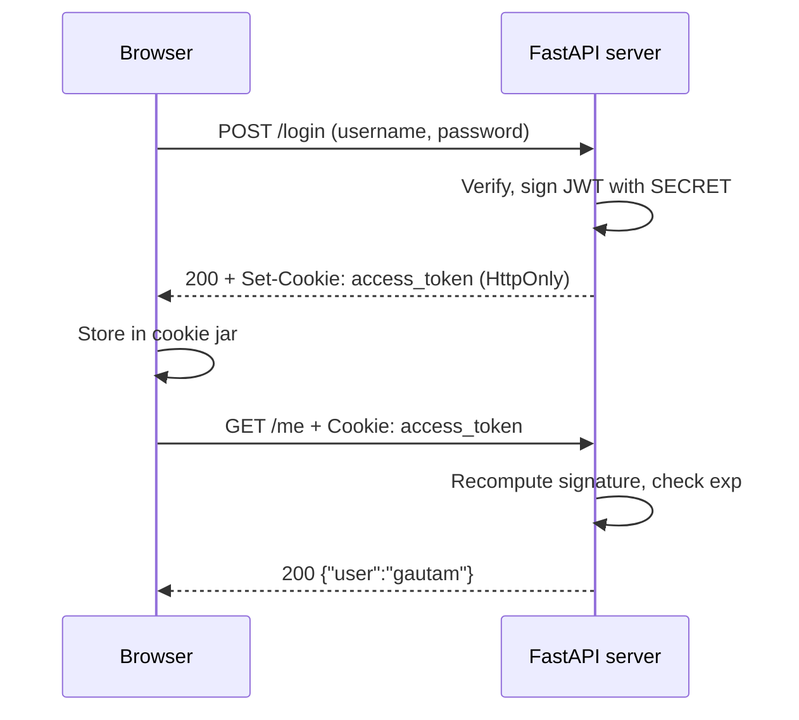
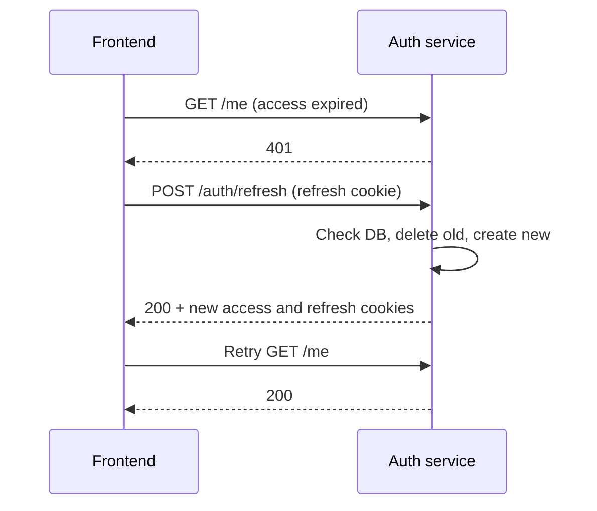

# HttpOnly Cookies vs localStorage: Auth with Next.js and FastAPI

## 1. The big picture

Store the login token in an HttpOnly cookie set by the backend, not in localStorage or a JS-readable cookie. The rest of this guide explains why, and how to build it with Next.js and FastAPI.

### The problem auth storage solves

HTTP is stateless. Every request arrives at the server as a stranger. So auth works in three steps:

1. The user logs in with a username and password.
2. The server verifies them and hands back proof of identity, usually a JWT token.
3. The client stores that proof and sends it back on every later request.

The whole debate is about step 3: where does the browser keep the token, and who attaches it to requests?

### The two choices

|  | localStorage / JS-readable cookie | HttpOnly cookie |
| --- | --- | --- |
| Who stores it | Your JavaScript | The browser, on the server's instruction |
| Who attaches it to requests | Your JavaScript, as `Authorization: Bearer ...` | The browser, automatically, as `Cookie: ...` |
| Can JavaScript read it | Yes | No |
| Main threat | XSS steals the token | CSRF, blocked by `SameSite` |
| Typical use | Tutorials, prototypes | Production web apps |

The token and its verification are identical in both. Only the delivery changes. That single fact clears up most confusion, so keep it in mind through every section.

### Analogy

- localStorage: the key is in your pocket. You take it out and open the door. A pickpocket can take it too.
- HttpOnly cookie: a security guard (the browser) holds the key. You can't take it out. The guard only uses it at the correct door.

## 2. Core vocabulary

You need three terms before anything else: vulnerability, origin vs site, and the same-origin policy.

### Vulnerability and attack

A vulnerability is a weakness that lets someone do what they shouldn't: read another user's data, act as them, or steal their login. An attack is the act of exploiting it. XSS and CSRF are both attacks that abuse the browser.

### Origin vs site

- Origin = protocol + host + port. All three must match exactly. This is strict.
- Site = protocol + main domain. Subdomains and ports don't matter. This is loose.

| A | B | Same origin? | Same site? |
| --- | --- | --- | --- |
| `http://localhost:3000` | `http://localhost:8000` | No, port differs | Yes |
| `https://app.x.com` | `https://api.x.com` | No, host differs | Yes |
| `https://vaidya-ep-dev.fractal.ai` | `https://api-dev-vaidya-ep.fractal.ai` | No, host differs | Yes, both under `fractal.ai` |
| `http://x.com` | `https://x.com` | No, protocol differs | No |
| `https://x.com` | `https://evil.com` | No | No |
| `http://localhost:3000` | `http://127.0.0.1:8000` | No | No, different hosts entirely |

The URL path (`/runs`, `/api/v1/...`) never matters for origin or site.

Why it matters: CORS cares about origin. SameSite cookies care about site. Your Next.js app and FastAPI API are usually different origins but the same site. So you need CORS, and SameSite=Lax cookies still flow.

### Same-origin policy

The browser's default rule: JavaScript on origin A can send a request to origin B, but cannot read B's response unless B explicitly permits it. CORS (section 7) is how B grants that permission.

## 3. JWT: why a token can't be faked

A JWT is safe to hand out because only the server's secret can produce a valid signature. Nobody can forge one without that secret.

### Structure

A JWT is three base64 parts joined by dots: `header.payload.signature`.

- Header: the algorithm, for example `{"alg":"HS256"}`.
- Payload: the data, for example `{"sub":"gautam","exp":1727000900}`.
- Signature: proof that the server created this exact header and payload.

A JWT is signed, not encrypted. Anyone holding it can decode and read the payload (try jwt.io). Never put passwords or private data in it.

### How signing works

```
signature = HMAC_SHA256(header + "." + payload, SECRET)
token     = header.payload.signature
```

On every request the server recomputes the signature with its own SECRET and compares:

1. Match: the token is genuine, so trust the payload.
2. No match: someone tampered with it, so reject with 401.
3. Then it checks `exp`. If the time has passed, reject with 401.

The server does not remember you. It re-checks the seal on every request. That is how it "knows" who you are: math, not memory, and not your IP address.

### Try forging one yourself

```python
import jwt
token = jwt.encode({"sub": "gautam"}, "change-me", algorithm="HS256")
h, p, s = token.split(".")
fake_p = jwt.utils.base64url_encode(b'{"sub":"admin"}').decode()
jwt.decode(f"{h}.{fake_p}.{s}", "change-me", algorithms=["HS256"])
# -> InvalidSignatureError
```

The old signature doesn't match the edited payload. To make a matching one, you need SECRET. So the SECRET must be long, random, and kept only in environment variables. If it leaks, anyone can forge tokens for any user.

### Forge vs steal vs replay

| Attack | Possible? | What stops it |
| --- | --- | --- |
| Forge a new token | No | The signature |
| Steal a real user's token | Very hard with HttpOnly | HttpOnly, Domain scoping, HTTPS |
| Replay a stolen token | Yes, until it expires | Short expiry, refresh rotation, revocation |

A JWT is a bearer token, like a movie ticket: whoever holds it gets in. That is why access tokens are short-lived (15 minutes).

## 4. Cookies 101

A cookie is a small name-value pair the browser stores per domain and attaches automatically to matching requests. This behavior is built into every browser by the HTTP standard. You don't write code for it.

### The cookie jar

The browser keeps a cookie jar: a store of cookies, each saved with the domain that set it plus its attributes. For example:

```
api-dev-vaidya-ep.fractal.ai
  access_token=eyJ...   HttpOnly  Secure  SameSite=Lax  Path=/  expires in 15 min
```

### How a cookie gets in: Set-Cookie

The server puts an instruction in its response header:

```
Set-Cookie: access_token=eyJ...; HttpOnly; Secure; SameSite=Lax; Path=/; Max-Age=900
```

Set-Cookie is an order: store this, and give it back to me later. Every browser obeys it.

### How a cookie goes out: the Cookie header

Before sending any request, the browser checks the jar:

1. Does the request's host match the cookie's domain?
2. Does the request's path start with the cookie's Path?
3. If the cookie is Secure, is the request HTTPS or WSS?
4. Does the SameSite rule allow this request (is it same-site)?
5. Is the cookie still unexpired?

If every check passes, the browser adds this line to the request by itself:

```
Cookie: access_token=eyJ...
```

Your code never wrote that line.

### Every attribute

| Attribute | What it controls | Typical value |
| --- | --- | --- |
| `HttpOnly` | JavaScript cannot read it; `document.cookie` hides it | Always on for tokens |
| `Secure` | Only sent over HTTPS or WSS | On in production, off for local `http://localhost` |
| `SameSite` | Whether it's sent on requests from other sites: `Strict`, `Lax` or `None` | `Lax` for access, `Strict` for refresh |
| `Path` | Which URL paths receive it, matched by prefix on segment boundaries | `/` for access, the auth path for refresh |
| `Domain` | Which hosts receive it. If unset, only the exact host that set it | Unset (tightest) |
| `Max-Age` | Seconds until the browser deletes it | Match the token's lifetime |

### SameSite values

- `Strict`: never sent on requests coming from another site.
- `Lax`: not sent on cross-site requests, except plain top-level link clicks (GET navigations).
- `None`: always sent, including cross-site. Requires `Secure`. Only needed when frontend and API are on different sites.

### Domain: the trade-off

- No Domain: the cookie belongs to the API host only. Browser calls to the API get it. Safest.
- `Domain=.fractal.ai`: sent to every `*.fractal.ai` subdomain, including your frontend host (so Next.js server code can read it), but also every other app on that domain. A compromised subdomain would receive your users' tokens.

## 5. JS cookies vs HttpOnly cookies

Both live in the same cookie jar. The difference is one label on the cookie, HttpOnly, and the browser uses that label to decide whether JavaScript may see it.

### Why one can be read and the other can't

1. JavaScript reads cookies through one door: `document.cookie`. Libraries like `js-cookie` are just wrappers around it. `Cookies.get("user_token")` is `document.cookie` with nicer parsing.
2. When JavaScript asks `document.cookie`, the browser goes through the jar and hands back only the cookies without the HttpOnly label. HttpOnly cookies are filtered out, as if they didn't exist.
3. The browser's network layer is not JavaScript. When it builds a request, it attaches all matching cookies, HttpOnly ones included.

So an HttpOnly cookie is invisible to JavaScript but still travels on every matching request.

### Who can put the HttpOnly label on

Only a server can, through the `Set-Cookie` response header. JavaScript can't. If JavaScript tries:

```js
document.cookie = "user_token=abc; HttpOnly";
```

the browser ignores the HttpOnly part and stores a normal, readable cookie. It has to: if JavaScript could create its own HttpOnly cookie, the protection would mean nothing. This is the whole reason the backend must set the cookie.

### Who creates the cookie decides what it is

| How the cookie was created | HttpOnly? | `Cookies.get()` / `document.cookie` sees it? |
| --- | --- | --- |
| `Cookies.set(...)` or `document.cookie = ...` in the browser | Never | Yes |
| Server `Set-Cookie` without the HttpOnly flag | No | Yes |
| Server `Set-Cookie` with the HttpOnly flag | Yes | No |

### What this means for code like this

```ts
import Cookies from "js-cookie";
export const USER_TOKEN = "user_token";
export function getAuthKey() {
  return Cookies.get(USER_TOKEN);
}
```

- If `getAuthKey()` returns a value, `user_token` is not HttpOnly. Any script on the page can read it, including an XSS attack. The risk is the same as localStorage; it's a token stored in a cookie instead.
- If it returns `undefined`, the cookie is HttpOnly, and this code can never read it.

The one real advantage of a JS-readable cookie over localStorage: cookies also reach your Next.js server, so middleware can check them. Against XSS it's no safer.

### Check any cookie in 10 seconds

1. Open the app, open the DevTools console, and run `document.cookie`. If you see the token, it's not HttpOnly.
2. Open DevTools, then Application, then Cookies. The HttpOnly column shows a tick only for protected cookies.

## 6. XSS and CSRF

Each storage method is weak against a different attack: localStorage against XSS, cookies against CSRF. SameSite fixes CSRF cheaply, while nothing fully fixes XSS. That is why HttpOnly cookies win.

### XSS: the attacker's JavaScript runs inside your page

The attacker gets their script executing on your site, in your user's browser, with the same powers as your own code.

Example: your app renders comments as raw HTML, and an attacker posts this comment:

```html

```

Every user who views it runs the attacker's code, and their token is sent to evil.com.

Common entry points:

1. Rendering user input as HTML (in React, `dangerouslySetInnerHTML`). React escapes `{text}` by default.
2. A compromised npm package in your bundle.
3. A hacked third-party script (analytics, chat widget).

Effect by storage:

- localStorage or JS cookie: the token is read and stolen. The attacker uses it from their own machine until it expires.
- HttpOnly cookie: the token can't be read. The attacker can only make requests while the user is on the page. HttpOnly limits the damage; it doesn't make XSS harmless.

### CSRF: the attacker's site makes your browser send a request

The attacker never touches your site. The user, logged in to your app, visits evil.com, which contains:

```html
<form action="https://bank.com/transfer" method="POST">
  <input name="to" value="attacker"> <input name="amount" value="50000">
</form>
<script>document.forms[0].submit()</script>
```

The browser sends the POST to bank.com and, without SameSite, attaches bank.com's cookie. The server thinks the real user sent it. The attacker never saw the cookie and didn't need to.

Effect by storage:

- localStorage: no CSRF risk. evil.com can't read your storage, so it can't add the Authorization header.
- Cookies: at risk, because they're attached automatically. `SameSite=Lax` or `Strict` stops the browser from attaching the cookie to requests coming from another site.

### Side by side

|  | XSS | CSRF |
| --- | --- | --- |
| Where the attacker's code runs | Inside your site | On their own site |
| What it abuses | Your page's JavaScript powers | The browser auto-sending cookies |
| Hurts localStorage / JS cookie | Yes, token stolen | No |
| Hurts HttpOnly cookie | Partly: misuse, no theft | Only without SameSite |
| Defense | Escape output, audit dependencies, CSP | SameSite (plus Origin checks) |

## 7. CORS and the wildcard rule

With cookies, CORS must list exact trusted origins and allow credentials. A wildcard `*` is forbidden by the CORS specification, and browsers enforce it.

### What CORS is

By default (the same-origin policy), JavaScript on origin A can send a request to origin B but can't read the response. CORS is B's response saying "origin A may read me":

```
Access-Control-Allow-Origin: https://vaidya-ep-dev.fractal.ai
Access-Control-Allow-Credentials: true
```

### Preflight

For non-simple requests, such as ones with `Content-Type: application/json`, the browser first sends an `OPTIONS` request asking whether it's allowed. The real request goes out only if the server says yes. FastAPI's CORS middleware answers preflights for you.

### Why `*` is forbidden with cookies

If `*` plus cookies were allowed:

1. The user is logged in to your API, with the cookie in their browser.
2. They visit evil.com.
3. evil.com runs `fetch("https://api.x.com/me", {credentials: "include"})`.
4. The cookie is attached, and `*` says any origin may read the response.
5. evil.com reads the user's private data.

So if a credentialed request gets back `Access-Control-Allow-Origin: *`, the browser blocks JavaScript from reading it. Chrome's console says the header must not be the wildcard when the credentials mode is include.

### When `*` is fine

| Auth style | `allow_origins=["*"]` | `allow_credentials` |
| --- | --- | --- |
| Token in Authorization header | Allowed | `False` is fine |
| HttpOnly cookie | Forbidden by the spec | Must be `True` |

This config works today for header auth and breaks for cookies:

```python
app.add_middleware(CORSMiddleware, allow_origins=["*"], allow_credentials=False,
                   allow_methods=["*"], allow_headers=["*"])
```

### FastAPI trap

With `allow_origins=["*"]` and `allow_credentials=True`, Starlette (FastAPI's CORS middleware) doesn't error. It echoes back whatever origin sent the request. It "works", but it trusts every website in the world with your users' cookies. Never ship that combination.

### The correct config

```python
import os

ALLOWED_ORIGINS = os.getenv("ALLOWED_ORIGINS", "http://localhost:3000").split(",")

app.add_middleware(
    CORSMiddleware,
    allow_origins=ALLOWED_ORIGINS,   # exact list, no "*"
    allow_credentials=True,          # required for cookies
    allow_methods=["*"],
    allow_headers=["*"],
)
```

```bash
# dev
ALLOWED_ORIGINS=https://vaidya-ep-dev.fractal.ai,http://localhost:3000
# prod
ALLOWED_ORIGINS=https://vaidya-ep.fractal.ai
```

Origin string rules:

1. Include the protocol: `https://...`
2. No trailing slash.
3. No path, so no `/runs`.
4. Include the port only if it's not the default, as in `http://localhost:3000`.

### CORS does not stop CSRF

CORS controls who can read responses. It doesn't stop a request from being sent. A malicious form POST still reaches your server. SameSite is what stops CSRF.

### Many subdomains

`allow_origin_regex=r"https://[a-z0-9-]+\.fractal\.ai"` matches preview deployments. Use it only if you trust every subdomain matching the pattern.

## 8. The full flow, message by message

Everything is plain text messages. The browser and server never "know" each other; they exchange text with headers, and each side follows fixed rules.



### Step 1: browser sends credentials

```
POST /login HTTP/1.1
Host: api.x.com
Origin: https://app.x.com
Content-Type: application/json

{"username":"gautam","password":"pass"}
```

Your `fetch()` in Next.js produced this. The browser added `Origin` itself. Because of the JSON content type, an `OPTIONS` preflight goes first.

### Step 2: server signs a token

Nothing is sent yet. The server checks the password, builds `{"sub":"gautam","exp":...}`, and signs it with SECRET.

### Step 3: server replies with Set-Cookie

```
HTTP/1.1 200 OK
Access-Control-Allow-Origin: https://app.x.com
Access-Control-Allow-Credentials: true
Set-Cookie: access_token=eyJ...; HttpOnly; Secure; SameSite=Lax; Path=/; Max-Age=900

{"ok":true}
```

The token is not in the body. The browser stores the cookie in its jar. The server keeps no record of you.

### Step 4: every later request carries the cookie

```
GET /me HTTP/1.1
Host: api.x.com
Origin: https://app.x.com
Cookie: access_token=eyJ...
```

Your code only wrote `fetch("/me", {credentials: "include"})`. The browser ran its jar checks (host, path, Secure, SameSite, expiry) and added the Cookie line.

### Step 5: server verifies with math

```
token = request.cookies["access_token"]
header, payload, sig = token.split(".")
expected = HMAC_SHA256(header + payload, SECRET)
expected == sig ?  yes -> untampered
exp > now ?        yes -> not expired
payload.sub        -> "gautam"
```

### Step 6: server responds

```
HTTP/1.1 200 OK
Access-Control-Allow-Origin: https://app.x.com
Access-Control-Allow-Credentials: true

{"user":"gautam"}
```

The browser checks the CORS headers and lets your JavaScript read the body. Steps 4 to 6 repeat for every call until the cookie expires.

### Step 7: an attacker edits the token

Changing `sub` to `admin` breaks the signature. The server recomputes, gets a mismatch, and returns 401. Anyone can send any Cookie header, for example with curl. Producing a valid signature without SECRET is impossible.

### Step 8: an attacker's site calls your API

```
GET /me HTTP/1.1
Host: api.x.com
Origin: https://evil.com
(no Cookie header)
```

The request comes from another site, and the cookie is SameSite=Lax, so the browser doesn't attach it. JavaScript on evil.com can't read the jar either. The server returns 401.

### Summary in one line

The server stamps a seal only it can make, the browser carries it and shows it only to the right server, and the server checks the seal every time.

See it for real: open DevTools, then Network. Click the login request to see Set-Cookie (step 3), then any later request to see the Cookie line (step 4).

## 9. Build the backend (FastAPI)

The backend does five jobs: CORS, create tokens, set the cookie at login, verify the cookie on each request, and delete it at logout. Type each piece into one `main.py`, in order.

```bash
pip install fastapi uvicorn pyjwt
```

### B1. App and CORS

```python
from fastapi import FastAPI, Response, HTTPException, Cookie, Depends
from fastapi.middleware.cors import CORSMiddleware
from pydantic import BaseModel
import jwt, datetime

app = FastAPI()
app.add_middleware(CORSMiddleware,
    allow_origins=["http://localhost:3000"],   # exact frontend origin
    allow_credentials=True, allow_methods=["*"], allow_headers=["*"])
```

Port 3000 and port 8000 are different origins, so CORS is needed. `allow_credentials=True` lets cookies flow.

### B2. Create tokens

```python
SECRET = "change-me"   # real apps: read from an environment variable

def create_token(username: str) -> str:
    exp = datetime.datetime.now(datetime.timezone.utc) + datetime.timedelta(minutes=15)
    return jwt.encode({"sub": username, "exp": exp}, SECRET, algorithm="HS256")
```

`sub` is who the token is for. `exp` makes it expire; PyJWT rejects expired tokens when decoding.

### B3. Login sets the cookie

```python
class LoginIn(BaseModel):
    username: str
    password: str

@app.post("/login")
def login(body: LoginIn, response: Response):
    if body.username != "gautam" or body.password != "pass":
        raise HTTPException(status_code=401, detail="Invalid credentials")
    response.set_cookie("access_token", create_token(body.username),
        httponly=True, secure=False, samesite="lax", path="/", max_age=900)
    return {"ok": True}
```

- `httponly=True`: protects against XSS theft.
- `secure=False`: only for local HTTP. Use `True` on HTTPS servers.
- `samesite="lax"`: protects against CSRF.
- `path="/"`: sent to every route.
- `max_age=900`: 15 minutes, matching the JWT expiry.

The token is not in the response body. JavaScript never touches it.

### B4. A dependency that verifies the cookie

```python
def get_current_user(access_token: str | None = Cookie(default=None)) -> str:
    if not access_token:
        raise HTTPException(status_code=401, detail="Not logged in")
    try:
        payload = jwt.decode(access_token, SECRET, algorithms=["HS256"])
    except jwt.PyJWTError:
        raise HTTPException(status_code=401, detail="Invalid or expired token")
    return payload["sub"]
```

`Cookie()` reads the cookie whose name matches the parameter. `jwt.decode` checks signature and expiry in one call.

### B5. A protected route

```python
@app.get("/me")
def me(user: str = Depends(get_current_user)):
    return {"user": user}
```

`Depends` runs `get_current_user` first. If it raises 401, the route body never runs.

### B6. Logout

```python
@app.post("/logout")
def logout(response: Response):
    response.delete_cookie("access_token", path="/")
    return {"ok": True}
```

JavaScript can't delete an HttpOnly cookie, so only the server can. The `path` (and `domain`, if set) must match `set_cookie`, or the delete silently fails.

### Run it

```bash
uvicorn main:app --reload --port 8000
```

### What changed vs the localStorage version

The verification is identical. Only two lines really differ.

```python
# Login. localStorage version: give the token to JS
return {"access_token": token}
# Login. HttpOnly version: give the token to the browser
response.set_cookie("access_token", token, httponly=True, secure=True, samesite="lax")

# Reading. localStorage version: Authorization: Bearer eyJ...
token = request.headers["Authorization"].removeprefix("Bearer ")
# Reading. HttpOnly version: Cookie: access_token=eyJ...
token = request.cookies["access_token"]

# Both: identical from here
payload = jwt.decode(token, KEY, algorithms=["HS256"])
```

| # | Change | Why | Where |
| --- | --- | --- | --- |
| 1 | Login uses `set_cookie` | JavaScript can't create HttpOnly cookies | Auth service |
| 2 | Read token from `request.cookies` | It arrives in the Cookie header now | Every service, 1 line |
| 3 | CORS with credentials and exact origins | Browsers require it for cookies | Every service the browser calls, or once at the gateway |
| 4 | A `/logout` route | JavaScript can't delete HttpOnly cookies | Auth service |

### Migration helper: accept both

```python
def get_token(request: Request) -> str | None:
    auth = request.headers.get("Authorization")
    if auth and auth.startswith("Bearer "):
        return auth[7:]                          # old way (header)
    return request.cookies.get("access_token")   # new way (cookie)
```

Old clients keep working while you switch.

## 10. Build the frontend (Next.js)

The frontend stores nothing and sends no Authorization header. Every API call just needs `credentials: "include"`.

```bash
npx create-next-app@latest frontend   # App Router; npm run dev serves port 3000
```

### C1. `lib/api.js`: login

```js
const API = "http://localhost:8000";

export async function login(username, password) {
  const res = await fetch(`${API}/login`, {
    method: "POST", credentials: "include",
    headers: { "Content-Type": "application/json" },
    body: JSON.stringify({ username, password }),
  });
  if (!res.ok) throw new Error("Login failed");
}
```

Without `credentials: "include"`, the browser ignores Set-Cookie on cross-origin responses and won't send cookies either. This is the number one cause of "my cookie isn't working". In axios, use `withCredentials: true`.

### C2. Same file: getMe and logout

```js
export async function getMe() {
  const res = await fetch(`${API}/me`, { credentials: "include" });
  if (res.status === 401) return null;
  return res.json();
}

export async function logout() {
  await fetch(`${API}/logout`, { method: "POST", credentials: "include" });
}
```

### C3. `app/page.jsx`

```jsx
"use client";
import { useEffect, useState } from "react";
import { login, getMe, logout } from "../lib/api";

export default function Home() {
  const [user, setUser] = useState(null);
  useEffect(() => { getMe().then(d => setUser(d?.user ?? null)); }, []);

  async function handleLogin() { await login("gautam", "pass"); const d = await getMe(); setUser(d?.user ?? null); }
  async function handleLogout() { await logout(); setUser(null); }

  return user
    ? <div>Hi {user} <button onClick={handleLogout}>Logout</button></div>
    : <button onClick={handleLogin}>Login</button>;
}
```

`"use client"` makes this run in the browser, where the cookie lives. `getMe()` on load checks whether a valid cookie already exists, so the user stays logged in across refreshes.

### How the UI knows who's logged in

JavaScript can't read the token, so it can't decode it for the user's name. Two options:

1. Call `/me` on load and keep the result in React state. This is the standard.
2. Have the server set a second, non-HttpOnly cookie with display-only info, like `user_name=Gautam`. Only for data that's harmless if exposed.

### Moving from `js-cookie` to HttpOnly

1. Delete `getAuthKey()`, `Cookies.set(...)` and the code adding `Authorization: Bearer ...`.
2. Add `credentials: "include"` to every API call.
3. Replace `Cookies.get()` login checks with a `/me` call.
4. Logout calls the backend `/logout`. `Cookies.remove()` can't touch an HttpOnly cookie.

### Next.js server side

Middleware, Server Components and route handlers run on the Next.js server, not in the browser. Two consequences:

- They only receive the cookie if it reaches the frontend's host, which needs `Domain=.fractal.ai` (see the trade-off in section 4).
- When the Next.js server calls FastAPI, it's the server making the request, so no cookie is attached automatically. You must forward the `Cookie` header yourself, or use a proxy.

### Local gotcha

Use `localhost` on both sides. `localhost` and `127.0.0.1` are different sites, so mixing them breaks SameSite=Lax.

## 11. Refresh tokens and rotation

Use two tokens: a 15-minute access token for every call, and a 7 to 30 day refresh token that only gets new access tokens. Users stay logged in, and a stolen access token dies fast.

### The two tokens

|  | Access token | Refresh token |
| --- | --- | --- |
| Purpose | Prove identity on every API call | Get a new access token |
| Lifetime | 15 minutes | 7 to 30 days |
| Format | JWT, verified without a DB | Random string, stored hashed in a DB |
| Cookie path | `/` (sent everywhere) | The auth path only |
| SameSite | `Lax` | `Strict` |
| Instant revocation | No, it just expires | Yes, delete it from the DB |

### Where each piece goes

1. Both are HttpOnly cookies set by the auth service.
2. The refresh cookie has a narrow Path, so it's sent only to auth routes. Other services never see it.
3. The refresh token is stored in the DB as a hash, never the raw value. A leaked DB gives attackers only hashes.
4. Rotation: each refresh consumes the old refresh token and issues a new one.

### The flow



If refresh also fails, the user is truly logged out: redirect to login.

### R1. Store and helpers

```python
import secrets, hashlib, time

REFRESH_TTL = 60 * 60 * 24 * 7          # 7 days
refresh_store = {}                        # learning only: use a DB or Redis

def hash_token(t: str) -> str:
    return hashlib.sha256(t.encode()).hexdigest()
```

### R2. Issue both cookies

```python
def issue_tokens(response: Response, username: str):
    refresh = secrets.token_urlsafe(32)
    refresh_store[hash_token(refresh)] = {"user": username, "exp": time.time() + REFRESH_TTL}
    response.set_cookie("access_token", create_token(username), httponly=True,
        secure=False, samesite="lax", path="/", max_age=900)
    response.set_cookie("refresh_token", refresh, httponly=True,
        secure=False, samesite="strict", path="/auth", max_age=REFRESH_TTL)
```

### R3. Login

```python
@app.post("/auth/login")
def login(body: LoginIn, response: Response):
    if body.username != "gautam" or body.password != "pass":
        raise HTTPException(status_code=401, detail="Invalid credentials")
    issue_tokens(response, body.username)
    return {"ok": True}
```

### R4. Refresh with rotation

```python
@app.post("/auth/refresh")
def refresh(response: Response, refresh_token: str | None = Cookie(default=None)):
    if not refresh_token:
        raise HTTPException(status_code=401, detail="No refresh token")
    record = refresh_store.pop(hash_token(refresh_token), None)   # pop = single use
    if not record or record["exp"] < time.time():
        raise HTTPException(status_code=401, detail="Refresh token invalid")
    issue_tokens(response, record["user"])
    return {"ok": True}
```

`pop` reads and removes the token in one step. That single line is rotation.

### R5. Logout revokes for real

```python
@app.post("/auth/logout")
def logout(response: Response, refresh_token: str | None = Cookie(default=None)):
    if refresh_token:
        refresh_store.pop(hash_token(refresh_token), None)
    response.delete_cookie("access_token", path="/")
    response.delete_cookie("refresh_token", path="/auth")
    return {"ok": True}
```

### Frontend: auto-refresh wrapper

```js
let refreshing = null;   // shared: 5 parallel 401s trigger only ONE refresh

export async function apiFetch(path, options = {}) {
  const opts = { ...options, credentials: "include" };
  const res = await fetch(`${API}${path}`, opts);
  if (res.status !== 401) return res;

  refreshing ??= fetch(`${API}/auth/refresh`, { method: "POST", credentials: "include" })
    .finally(() => { refreshing = null; });
  const r = await refreshing;
  if (!r.ok) return res;              // truly logged out: caller redirects
  return fetch(`${API}${path}`, opts); // retry once with the new cookie
}
```

1. The shared `refreshing` promise matters. Without it, five parallel 401s fire five refreshes; the first consumes the token and the other four fail, logging the user out.
2. The refresh call uses raw `fetch`, not `apiFetch`, so a failed refresh can't loop forever.

### Production upgrades

1. Reuse detection: if an already-used refresh token shows up, it was stolen. Revoke every token for that user.
2. A real table: `refresh_tokens(hash, user_id, expires_at, revoked, created_at, user_agent)`.
3. "Log out all devices" means deleting every row for that user.

### Practice

Set access `max_age` and JWT expiry to 30 seconds. Log in, wait 35 seconds, call `/me`. The Network tab should show `/me` 401, then `/auth/refresh` 200, then `/me` 200. Then send the same old refresh cookie twice with curl: the second call must fail.

## 12. Microservices

Only the auth service creates, sets and deletes cookies. Every other service just reads the cookie and verifies the token, about ten lines of code.

### What code goes where

|  | Auth service | Other service (e.g. runs) |
| --- | --- | --- |
| Login, refresh, logout routes | Yes | No |
| Creates tokens | Yes | No |
| Verifies tokens | Yes | Yes, a small dependency |
| Sets or deletes cookies | Yes | No |
| Knows passwords or the user DB | Yes | No |
| CORS config | Yes | Yes, if the browser calls it directly |

### Signing algorithm: use RS256

1. HS256 (one shared secret): every service needs the same SECRET. The key that verifies can also create, so one leaky service lets an attacker forge tokens for all of them.
2. RS256 (key pair), recommended: the auth service holds the private key and is the only one that can sign. Other services hold the public key, which can only verify. Leaking it is harmless.

```python
# Auth service (pip install "pyjwt[crypto]")
token = jwt.encode(payload, PRIVATE_KEY, algorithm="RS256")

# Every other service
payload = jwt.decode(token, PUBLIC_KEY, algorithms=["RS256"], audience="vaidya-ep")
```

```bash
openssl genrsa -out private.pem 2048
openssl rsa -in private.pem -pubout -out public.pem
```

Add `iss` (issuer) and `aud` (audience) claims so a token meant for one system isn't accepted by another.

### How the cookie reaches every service

A cookie without Domain is only sent to the exact host that set it.

- Option A, an API gateway on one host (recommended): all services under one host, split by path, such as `api.x.com/auth-svc/...` and `api.x.com/runs-svc/...`. One host means the cookie reaches all of them. The URL pattern `api-dev-vaidya-ep.fractal.ai/vaidya-ep-api-svc/...` looks like this setup.
- Option B, separate hosts: `auth.x.com` and `runs.x.com` need `Domain=.x.com`, which sends the cookie to every subdomain. It works, with wider exposure.

### Gateway variation

The gateway verifies the JWT and forwards a header like `X-User-Id: gautam`. Services trust that header only because the network blocks direct access to them. Less code per service, but only safe if that network rule truly holds.

### CORS in a microservice setup

- If all services sit behind one gateway, configure CORS once at the gateway. Each service then changes just one line: read the token from the cookie.
- If both the gateway and a service add CORS headers, the browser sees a duplicate `Access-Control-Allow-Origin` and rejects the response. Pick one place.

### Shared helper

Put the `get_token` helper from section 9 plus the RS256 decode in a small shared package, or copy it into each service. Then every service does `get_token(request)` and `jwt.decode(...)` exactly as before.

## 13. WebSockets

HttpOnly cookies make WebSocket auth easier: the browser sends the cookie on the connection automatically, so you don't need the token in JavaScript. You must add an Origin check yourself.

### Why it works: a WebSocket starts as an HTTP request

```
GET /ws HTTP/1.1
Host: api-dev-vaidya-ep.fractal.ai
Upgrade: websocket
Connection: Upgrade
Origin: https://vaidya-ep-dev.fractal.ai
Cookie: access_token=eyJ...        <- attached automatically
```

The server checks it, replies `101 Switching Protocols`, and the connection stays open for two-way messages. Authentication happens once, at this handshake. The same jar rules apply: host, path, Secure and SameSite.

### Why localStorage is worse here

The browser's `WebSocket` API can't set custom headers, so there's no way to add `Authorization: Bearer ...`. The workarounds all have problems:

| Workaround | Problem |
| --- | --- |
| `wss://api/ws?token=eyJ...` | Token lands in server, proxy and monitoring logs |
| Token as the first message | Connection is open but unauthenticated until then |
| Token in `Sec-WebSocket-Protocol` | A hack that confuses proxies |

### The Origin check is mandatory

CORS does not apply to WebSockets. The browser sends `Origin` but enforces nothing. Without a server-side check you're exposed to cross-site WebSocket hijacking: evil.com opens a socket to your API and reads live data if the cookie is attached. SameSite=Lax blocks most of this; the Origin check is the explicit guard and also covers other subdomains of the same site.

### Backend

```python
from fastapi import WebSocket, WebSocketDisconnect, status
import time

ALLOWED = set(ALLOWED_ORIGINS)   # same list as CORS

@app.websocket("/ws")
async def ws_endpoint(websocket: WebSocket):
    if websocket.headers.get("origin") not in ALLOWED:
        await websocket.close(code=status.WS_1008_POLICY_VIOLATION)
        return
    try:
        payload = jwt.decode(websocket.cookies.get("access_token"), KEY, algorithms=["RS256"])
    except Exception:
        await websocket.accept()
        await websocket.close(code=4001)   # "refresh and retry"
        return
    await websocket.accept()
    user = payload["sub"]
    try:
        while True:
            msg = await websocket.receive_text()
            if time.time() > payload["exp"]:
                await websocket.close(code=4001)
                break
            await websocket.send_text(f"{user}: {msg}")
    except WebSocketDisconnect:
        pass
```

For a bad token it accepts, then closes with 4001. Rejecting before accept gives the browser only a generic code 1006, so the frontend couldn't tell why. Codes 4000 to 4999 are yours to define.

### Frontend

```js
const WS_URL = "wss://api-dev-vaidya-ep.fractal.ai/vaidya-ep-api-svc/ws";

export function connect(onMessage) {
  const ws = new WebSocket(WS_URL);      // no token: cookie goes automatically
  ws.onmessage = (e) => onMessage(e.data);
  ws.onclose = async (e) => {
    if (e.code !== 4001) return;          // only handle "token expired"
    const r = await fetch(`${API}/auth/refresh`, { method: "POST", credentials: "include" });
    if (r.ok) connect(onMessage);
    else window.location.href = "/login";
  };
  return ws;
}
```

There's no `credentials` option for WebSockets. Browsers send cookies on the handshake by default.

### The expiry problem

HTTP requests are checked every time. A WebSocket is checked once, then stays open. Without a fix, a socket opened at 10:00 with a 15-minute token still works at 11:00. The server remembers `exp` and closes with 4001 when it passes; the frontend refreshes and reconnects. For sockets where only the server sends, run the check on a timer or before each push.

### Checklist

1. Use `wss://`, not `ws://`. Secure cookies need an encrypted connection.
2. The access cookie's `path="/"` covers the WebSocket path.
3. Frontend and API under `fractal.ai` are same-site, so Lax cookies are sent.
4. The gateway must support WebSocket upgrades, forward `Cookie` and `Origin`, and allow a long idle timeout.
5. Reuse the CORS `ALLOWED_ORIGINS` list for the Origin check.

Fallback if the WebSocket server is ever on a different site: a cookie-authenticated `/ws-ticket` endpoint returns a one-time 30-second ticket, then connect with `wss://.../ws?ticket=...`. Not needed for the current domains.

## 14. What data can go in a cookie

A cookie holds identity (who you are and what you may do), never data. Everything else comes from an API using that identity.

### Hard limits

1. Size: about 4 KB per cookie, name and attributes included. Anything larger is silently dropped.
2. It's sent on every matching request, so a big cookie slows every call.
3. A JWT payload is readable. HttpOnly hides it from JavaScript, but the user can open DevTools, and anyone who steals it can decode it.

### What to put in, what to keep out

| Put in | Keep out |
| --- | --- |
| `sub`: the user ID | Passwords, secrets, API keys |
| `exp`, `iat`: expiry and issued-at | Health, medical or patient data |
| `jti`: a unique token ID for revocation | Full profiles, addresses, phone numbers |
| `role` or a small permission set | Large permission lists |
| `tenant_id` / `org_id` if multi-tenant | Anything that changes often; the token stays stale until expiry |
| `iss`, `aud`: issuer and audience | Email, unless needed for authorization |

### The alternative: session IDs

Instead of a JWT, the cookie holds a random ID like `sid=a8f3k...`, and all data lives server-side in Redis or a DB.

|  | JWT in the cookie | Session ID in the cookie |
| --- | --- | --- |
| Services verify without a DB | Yes | No, every request hits Redis |
| Instant revocation | No, hence refresh tokens | Yes, delete the key |
| Payload visible if stolen | Yes | No, it's just a random string |
| Best for | Microservices | Monoliths, very sensitive apps |

The access plus refresh setup is a hybrid: the access token is a stateless JWT, and the refresh token is a stateful, revocable ID.

## 15. Reading the real config

The project config follows this guide's pattern: two HttpOnly cookies, a narrow path for refresh, and user data (not tokens) in the login body. Two details need checking: the refresh path vs the gateway prefix, and both cookies sharing a 30-day lifetime.

### The env variables

```ini
SESSION_COOKIE_SECURE=true
SESSION_COOKIE_MAX_AGE_DAYS=30
REFRESH_COOKIE_PATH=/api/v1/vaidya-ep/auth
```

| Variable | Meaning |
| --- | --- |
| `SESSION_COOKIE_SECURE=true` | Sets the Secure flag: HTTPS/WSS only. `false` only for local `http://localhost` |
| `SESSION_COOKIE_MAX_AGE_DAYS=30` | How long the browser keeps the cookies before deleting them |
| `REFRESH_COOKIE_PATH` | The refresh cookie is only sent to URLs starting with this path |

### The login code

```python
def _start_session(response: Response, session: Session) -> AstraResponse:
    tokens = {ACCESS_COOKIE: session.access_token, REFRESH_COOKIE: session.refresh_token}
    for name, path in COOKIE_PATHS.items():
        response.set_cookie(name, tokens[name], max_age=COOKIE_MAX_AGE, path=path, **COOKIE_FLAGS)
    return AstraResponse.ok({"user": session.user.model_dump()})
```

`COOKIE_PATHS` is most likely a dict mapping each cookie name to its path, and `COOKIE_FLAGS` the shared flags:

```python
COOKIE_PATHS = {
    ACCESS_COOKIE:  "/",                    # sent to every route
    REFRESH_COOKIE: REFRESH_COOKIE_PATH,    # sent only to auth routes
}
COOKIE_FLAGS = {"httponly": True, "secure": SESSION_COOKIE_SECURE, "samesite": "lax"}
```

The loop pairs each name with its value (from `tokens`) and its path (from `COOKIE_PATHS`). It's the same as two explicit calls:

```python
response.set_cookie(ACCESS_COOKIE,  session.access_token,  max_age=COOKIE_MAX_AGE,
                    path="/", httponly=True, secure=True, samesite="lax")
response.set_cookie(REFRESH_COOKIE, session.refresh_token, max_age=COOKIE_MAX_AGE,
                    path="/api/v1/vaidya-ep/auth", httponly=True, secure=True, samesite="lax")
```

`**COOKIE_FLAGS` unpacks the dict into keyword arguments: `**{"httponly": True}` becomes `httponly=True`. The login body returns only `{"user": ...}`; the tokens are not in it.

### Why a cookie path

The access cookie (`/`) is needed by every call. The refresh cookie is powerful (30 days, mints access tokens) and only needed by refresh and logout. With the narrow path, a normal call such as fetching runs carries only the access cookie. The refresh token never reaches other services, never appears in their logs, and only travels when needed.

Paths match by prefix on segment boundaries: `/api/v1/vaidya-ep/auth` matches `.../auth/refresh` and `.../auth/logout`, not `.../runs` and not `.../authx`.

### Gotcha: the gateway prefix

The browser matches paths against the URL it sees:

```
https://api-dev-vaidya-ep.fractal.ai/vaidya-ep-api-svc/api/v1/vaidya-ep/auth/me
```

If the gateway strips `/vaidya-ep-api-svc` before forwarding, FastAPI sees `/api/v1/...` and the config looks right from the code. But the browser compares:

```
/vaidya-ep-api-svc/api/v1/vaidya-ep/auth/refresh   (request URL)
/api/v1/vaidya-ep/auth                             (cookie path)
-> doesn't start with it -> refresh cookie NOT sent
```

Symptom: login works, then once the access token expires, refresh returns 401 and users are logged out.

Verify:

1. Log in, open DevTools, then Application, then Cookies, then `api-dev-vaidya-ep.fractal.ai`. Read the Path column for the refresh cookie.
2. Trigger a refresh. In Network, click `/auth/refresh` and check whether the request's Cookie header includes the refresh cookie.

If missing, fix it and delete with the same path at logout:

```ini
REFRESH_COOKIE_PATH=/vaidya-ep-api-svc/api/v1/vaidya-ep/auth
```

Also check the `.env` line has no trailing space after `auth`.

### Observation: both cookies use 30 days

`max_age=COOKIE_MAX_AGE` applies to both cookies.

- Fine if the access JWT has its own short `exp` (say 15 minutes). The browser keeps an expired token for 30 days, the server rejects it by `exp`, and refresh kicks in. Works, just untidy.
- A problem if the access JWT's `exp` is also 30 days. A stolen access token would then work for a month with no way to revoke it.

Check what expiry `session.access_token` is created with. Cleaner version:

```python
COOKIE_MAX_AGES = {ACCESS_COOKIE: 15 * 60, REFRESH_COOKIE: 30 * 24 * 3600}
# inside the loop: max_age=COOKIE_MAX_AGES[name]
```

## 16. Debugging checklist

Most cookie bugs are one of four symptoms. Check them in this order, with DevTools open.

| Symptom | Where to look | Usual causes |
| --- | --- | --- |
| Cookie not stored | Network, login request, response headers: `Set-Cookie`. A yellow warning icon means Chrome rejected it; hover for the reason | Missing `credentials: "include"` on login; `Secure=True` on plain HTTP; `SameSite=None` without Secure |
| CORS error in console | Console, then the response's `Access-Control-Allow-*` headers | Origin mismatch (trailing slash, protocol, port); `allow_credentials` not `True`; `*` with credentials; duplicate CORS headers from gateway and service |
| Cookie stored but not sent | Network, the failing request, request headers: `Cookie` | Path doesn't match the browser URL (gateway prefix); `localhost` vs `127.0.0.1`; missing `credentials: "include"`; `Secure` cookie on HTTP |
| Logout doesn't clear it | Application, then Cookies | `delete_cookie` path or domain differs from `set_cookie` |
| Works, then logs out after 15 min | Network, `/auth/refresh` request | Refresh cookie path too narrow; parallel refreshes racing without the shared promise |
| WebSocket rejected | Network, WS filter, handshake headers | Origin not in the allowed list; `ws://` with Secure cookie; gateway not forwarding Cookie or Upgrade |

### Break it on purpose

Build the working version, then break one thing at a time and watch what fails in DevTools:

1. Remove `credentials: "include"`.
2. Change the CORS origin by one character.
3. Set `secure=True` while on HTTP.
4. Set the refresh path to something that doesn't match.
5. Open the app on `127.0.0.1` instead of `localhost`.

After this, you can debug it for anyone.

## 17. Explaining it to others

Use the 30-second version first, then answer questions from the FAQ.

### The 30-second version

After login, FastAPI puts the JWT in an HttpOnly cookie instead of returning it. The browser stores it and sends it on every request, but JavaScript can't read it, so an XSS bug can't steal the token. Cookies bring a CSRF risk, and SameSite=Lax blocks that. The frontend only adds `credentials: "include"`. The backend's CORS must list our exact frontend origin with credentials allowed, because browsers forbid `*` with cookies.

### FAQ

1. Why not localStorage? It's simpler. Any script on the page can read localStorage, including a compromised npm package. One XSS bug and every logged-in user's token is stolen.
2. Is HttpOnly XSS-proof? No. It prevents theft, not misuse while the user is on the page. You still need to prevent XSS itself.
3. Why can `js-cookie` read our cookie? Because it isn't HttpOnly. JavaScript can only see non-HttpOnly cookies, and only a server's `Set-Cookie` can add the HttpOnly flag.
4. If the browser stores it, why does the backend need code? JavaScript can't create or delete HttpOnly cookies. The server sets it at login, verifies it per request, and deletes it at logout.
5. Is verification different from the header version? No. Same token, same `jwt.decode`. Only where it's read from changes: `request.cookies` instead of the Authorization header.
6. Why is CORS failing with `*`? The CORS spec forbids a wildcard origin with credentials. List exact origins.
7. Does CORS stop CSRF? No. CORS blocks reading responses, not sending requests. SameSite stops CSRF.
8. Does it use the IP address? No. IPs change (Wi-Fi to mobile data) and many users share one (carrier NAT, VPNs). Security comes from the signature and the browser's cookie rules.
9. Can a stolen cookie be reused? Yes, until it expires. That's why access tokens last 15 minutes and refresh tokens rotate.
10. How do we log out? A backend route deletes the cookies and revokes the refresh token. The frontend can't delete them.
11. Why does it work between app and api subdomains? Same site, so SameSite=Lax cookies are sent. Different origins, so CORS is still required.
12. What about WebSockets? The handshake is an HTTP request, so the cookie goes automatically. Check the Origin header on the server, because CORS doesn't apply.
13. What about microservices? The auth service sets and deletes cookies. Every other service reads the cookie and verifies with the RS256 public key.

### Next topics to learn

1. Next.js middleware: protecting pages on the server before they render.
2. Production checklist: domains, a proxy via Next.js rewrites, deployment.

---

**Related:** this is the auth used in milestone 3 of [`../fastapi-from-scratch/03-build-to-learn-tasks-api.md`](../fastapi-from-scratch/03-build-to-learn-tasks-api.md). FastAPI cookies/`Depends` basics: [`../fastapi-from-scratch/01-core-concepts.md`](../fastapi-from-scratch/01-core-concepts.md).
