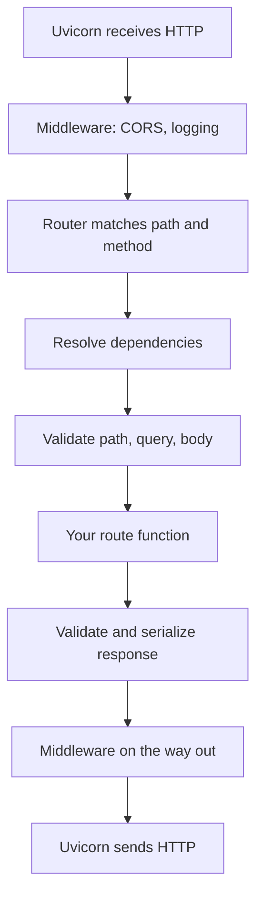

# FastAPI Part 1: Core Concepts

## 1. What FastAPI is, and your first app

FastAPI is a Python web framework that turns type-hinted functions into HTTP endpoints, validates input automatically, and generates interactive API docs. It is built on Starlette (the web layer) and Pydantic (the data layer).

### The pieces

| Piece | Role |
| --- | --- |
| FastAPI | Routes, dependency injection, validation, docs |
| Starlette | Underlying web toolkit: requests, responses, middleware, WebSockets |
| Pydantic | Data models and validation |
| Uvicorn | The ASGI server that actually listens on a port and runs the app |

ASGI is the standard interface between a Python async web app and its server. Uvicorn speaks ASGI; FastAPI implements it.

### Setup

```bash
mkdir api && cd api
python3 -m venv .venv && source .venv/bin/activate
pip install "fastapi[standard]"      # includes uvicorn and common extras
```

### First app

```python
# main.py
from fastapi import FastAPI

app = FastAPI(title="Vaidya API", version="0.1.0")

@app.get("/health")
def health():
    return {"status": "ok"}
```

- `app = FastAPI(...)` creates the application object. Its `__init__` accepts settings like `title`.
- `@app.get("/health")` registers the function for `GET /health`.
- Returning a dict sends JSON. FastAPI converts it for you.

### Run it

```bash
fastapi dev main.py                       # dev mode, auto-reload
# or directly:
uvicorn main:app --reload --port 8000
```

`main:app` means "the `app` object inside `main.py`". `--reload` restarts on every file save; use it only in development.

### Automatic docs

Open these in a browser while the server runs:

1. `http://localhost:8000/docs`: Swagger UI. Try every endpoint with a Try it out button.
2. `http://localhost:8000/redoc`: a readable reference page.
3. `http://localhost:8000/openapi.json`: the raw OpenAPI schema, used to generate client code.

The docs come from your paths, type hints and Pydantic models. Better hints mean better docs.

### HTTP methods

| Decorator | Method | Typical use |
| --- | --- | --- |
| `@app.get` | GET | Read data |
| `@app.post` | POST | Create, or run an action like login |
| `@app.put` | PUT | Replace a whole resource |
| `@app.patch` | PATCH | Update part of a resource |
| `@app.delete` | DELETE | Remove |
| `@app.websocket` | WebSocket | Two-way live connection |

## 2. Path and query parameters

FastAPI decides where each function parameter comes from by its name and type: a name in the path is a path parameter, a simple type not in the path is a query parameter, and a Pydantic model is the body.

### Path parameters

```python
@app.get("/runs/{run_id}")
def get_run(run_id: int):
    return {"run_id": run_id}
```

- `GET /runs/42` gives `run_id = 42` as an int, converted automatically.
- `GET /runs/abc` returns 422 with a clear error, because `abc` isn't an int.

### Query parameters

Anything after `?` in the URL. Parameters not in the path become query parameters.

```python
@app.get("/runs")
def list_runs(status: str | None = None, limit: int = 20, skip: int = 0):
    return {"status": status, "limit": limit, "skip": skip}
```

| Request | Result |
| --- | --- |
| `GET /runs` | `status=None, limit=20, skip=0` |
| `GET /runs?status=done&limit=5` | `status="done", limit=5, skip=0` |
| `GET /runs?limit=abc` | 422 error |

A parameter with no default is required. `limit: int` with no default makes `?limit=` mandatory.

### Extra validation with `Query` and `Path`

```python
from typing import Annotated
from fastapi import Query, Path

@app.get("/runs/{run_id}")
def get_run(
    run_id: Annotated[int, Path(gt=0)],                        # must be > 0
    limit: Annotated[int, Query(ge=1, le=100)] = 20,           # 1..100
    q: Annotated[str | None, Query(max_length=50)] = None,
):
    ...
```

`Annotated[type, extra_info]` attaches FastAPI rules to a type hint. It's the modern recommended style; older code writes `limit: int = Query(20, ge=1)`.

### Fixed choices with Enum

```python
from enum import Enum

class Status(str, Enum):
    pending = "pending"
    done = "done"

@app.get("/runs")
def list_runs(status: Status | None = None):
    ...
```

Only `pending` or `done` are accepted, and the docs show a dropdown.

### Lists in the query

```python
@app.get("/runs")
def list_runs(tag: Annotated[list[str], Query()] = []):
    ...
# GET /runs?tag=a&tag=b  ->  tag=["a", "b"]
```

### Route order matters

```python
@app.get("/runs/latest")          # must come first
def latest(): ...

@app.get("/runs/{run_id}")        # otherwise this would catch "latest"
def get_run(run_id: int): ...
```

FastAPI checks routes top to bottom and uses the first match.

## 3. Request bodies and response models

Declare a Pydantic model as a parameter and FastAPI parses the JSON body into it, validating every field. Declare a `response_model` and FastAPI filters and validates what you send back.

### Request body

```python
from pydantic import BaseModel

class RunCreate(BaseModel):
    name: str
    model: str = "gpt-4o"
    max_tokens: int = 1000

@app.post("/runs")
def create_run(body: RunCreate):
    return {"created": body.name, "tokens": body.max_tokens}
```

Sending `{"name": "eval-1"}` gives `body.name == "eval-1"` and the defaults for the rest. Sending `{}` returns 422 saying `name` is required.

### Field rules

```python
from pydantic import BaseModel, Field, EmailStr

class SignUp(BaseModel):
    email: EmailStr                                  # must look like an email
    password: str = Field(min_length=8)
    age: int = Field(ge=13, le=120)
    tags: list[str] = Field(default_factory=list)
```

`EmailStr` needs `pip install "pydantic[email]"` (already included in `fastapi[standard]`).

### Nested models

```python
class Address(BaseModel):
    city: str
    pin: str

class Profile(BaseModel):
    name: str
    address: Address           # a model inside a model
```

The body `{"name": "g", "address": {"city": "Bengaluru", "pin": "560001"}}` validates both levels.

### Custom validators

```python
from pydantic import field_validator

class RunCreate(BaseModel):
    name: str

    @field_validator("name")
    @classmethod
    def no_spaces(cls, v: str) -> str:
        if " " in v:
            raise ValueError("name must not contain spaces")
        return v.lower()          # you can also transform the value
```

### Separate models for input and output

Never return your internal model directly if it has private fields. Use different models:

```python
class UserIn(BaseModel):          # what the client sends
    username: str
    password: str

class UserOut(BaseModel):         # what the client receives
    id: int
    username: str

@app.post("/users", response_model=UserOut, status_code=201)
def create_user(body: UserIn):
    user = save(body)             # may contain hashed_password, etc.
    return user                   # FastAPI keeps only UserOut's fields
```

`response_model` does three jobs: it removes extra fields (so `hashed_password` never leaks), validates the output, and documents the response shape. You can also write the return type instead: `def create_user(body: UserIn) -> UserOut:`.

### Returning ORM objects

When returning database objects (not dicts), allow Pydantic to read attributes:

```python
class UserOut(BaseModel):
    model_config = {"from_attributes": True}
    id: int
    username: str
```

### Useful Pydantic methods

| Method | What it does |
| --- | --- |
| `body.model_dump()` | Model to dict |
| `body.model_dump(exclude_unset=True)` | Only fields the client actually sent; ideal for PATCH |
| `body.model_dump_json()` | Model to JSON string |
| `Model.model_validate(data)` | Dict or object to model, with validation |
| `body.model_copy(update={...})` | Copy with some fields changed |

### Body, path and query together

```python
@app.patch("/runs/{run_id}")
def update_run(run_id: int, body: RunUpdate, notify: bool = False):
    ...
```

`run_id` from the path, `body` from JSON, `notify` from `?notify=true`. FastAPI sorts them out by name and type.

## 4. Status codes and errors

Set the success code on the decorator, raise `HTTPException` for expected errors, and register exception handlers to turn your own exceptions into consistent JSON errors.

### Status codes you'll use

| Code | Meaning | When |
| --- | --- | --- |
| 200 | OK | Default for success |
| 201 | Created | POST that creates something |
| 204 | No Content | DELETE, or success with nothing to return |
| 400 | Bad Request | Input is valid JSON but makes no sense |
| 401 | Unauthorized | Not logged in, or token invalid or expired |
| 403 | Forbidden | Logged in, but not allowed |
| 404 | Not Found | Resource doesn't exist |
| 409 | Conflict | Duplicate, e.g. username taken |
| 422 | Unprocessable Entity | Validation failed; FastAPI returns this automatically |
| 500 | Internal Server Error | An unhandled bug |

The 401 vs 403 split matters for the frontend: 401 means try refreshing the token, 403 means show "no access".

### Setting the success code

```python
from fastapi import status

@app.post("/runs", status_code=status.HTTP_201_CREATED)
def create_run(body: RunCreate): ...

@app.delete("/runs/{run_id}", status_code=204)
def delete_run(run_id: int): ...   # return nothing
```

### HTTPException

```python
from fastapi import HTTPException

@app.get("/runs/{run_id}")
def get_run(run_id: int):
    run = RUNS.get(run_id)
    if run is None:
        raise HTTPException(status_code=404, detail="Run not found")
    return run
```

The client receives `{"detail": "Run not found"}` with status 404. `detail` can also be a dict. You can add headers: `HTTPException(401, detail=..., headers={"WWW-Authenticate": "Bearer"})`.

### The automatic 422

When validation fails, FastAPI replies with a list of what went wrong:

```json
{"detail": [{"type": "missing", "loc": ["body", "name"], "msg": "Field required"}]}
```

`loc` tells you exactly where: body, query or path, plus the field name. Read this first when debugging.

### Your own exceptions and handlers

Keep business code free of HTTP details, and map errors to responses in one place:

```python
from fastapi import Request
from fastapi.responses import JSONResponse

class NotFoundError(Exception):
    def __init__(self, what: str):
        self.what = what

@app.exception_handler(NotFoundError)
async def not_found_handler(request: Request, exc: NotFoundError):
    return JSONResponse(status_code=404, content={"error": f"{exc.what} not found"})

# anywhere in your code:
raise NotFoundError("Run")
```

Projects often define one base error class with `status_code` and `message` attributes, plus one handler for all of it. The `AstraResponse.ok(...)` wrapper in the project code is the same idea for successful responses: one consistent shape.

### Catch-all for unexpected errors

```python
@app.exception_handler(Exception)
async def unhandled(request: Request, exc: Exception):
    logger.exception("unhandled error")          # log the full traceback
    return JSONResponse(status_code=500, content={"error": "Internal error"})
```

Never send the raw exception text to clients. It can leak paths, SQL or secrets.

## 5. Dependency injection with `Depends`

`Depends(func)` tells FastAPI: before running this route, run `func`, and pass its result in. Auth checks, DB sessions, settings and pagination all use this one mechanism.

### The basic idea

```python
from fastapi import Depends

def pagination(skip: int = 0, limit: int = 20) -> dict:
    return {"skip": skip, "limit": limit}

@app.get("/runs")
def list_runs(page: dict = Depends(pagination)):
    return page
```

For `GET /runs?limit=5`, FastAPI:

1. Sees `Depends(pagination)` in the route's signature.
2. Reads `pagination`'s own parameters and fills them from the request: `skip=0, limit=5`.
3. Calls `pagination(...)` and gets the dict.
4. Calls `list_runs(page=that_dict)`.

Note you pass `pagination`, not `pagination()`: the function itself, which FastAPI calls for you on each request.

### A dependency can use request data

A dependency's parameters work exactly like a route's: query, path, headers, cookies, body, or other dependencies.

```python
def get_current_user(access_token: str | None = Cookie(default=None)) -> str:
    if not access_token:
        raise HTTPException(status_code=401, detail="Not logged in")
    return decode(access_token)["sub"]

@app.get("/me")
def me(user: str = Depends(get_current_user)):
    return {"user": user}
```

If the dependency raises, the route never runs. That's how one function protects many routes.

### Dependencies can depend on dependencies

```python
def get_admin(user: str = Depends(get_current_user)) -> str:
    if user not in ADMINS:
        raise HTTPException(status_code=403, detail="Admins only")
    return user

@app.delete("/runs/{run_id}")
def delete_run(run_id: int, admin: str = Depends(get_admin)):
    ...
```

FastAPI resolves the chain: cookie, then `get_current_user`, then `get_admin`, then the route. Within one request, each dependency runs only once even if several parts ask for it; the result is cached.

### `yield` dependencies: setup and cleanup

```python
def get_db():
    db = SessionLocal()
    try:
        yield db            # route runs here, using db
    finally:
        db.close()          # always runs afterward

@app.get("/runs")
def list_runs(db = Depends(get_db)):
    return db.query(Run).all()
```

Code before `yield` runs before the route; code after runs once the route finishes. Each request gets its own session, closed even on errors.

### Class dependencies

A class works as a dependency, because calling a class runs `__init__`:

```python
class Pagination:
    def __init__(self, skip: int = 0, limit: int = 20):
        self.skip = skip
        self.limit = limit

@app.get("/runs")
def list_runs(page: Pagination = Depends()):   # Depends() with no arg = use the type
    return {"skip": page.skip}
```

### Configurable dependencies with `__call__`

```python
class RequireRole:
    def __init__(self, role: str):
        self.role = role

    def __call__(self, user: str = Depends(get_current_user)) -> str:
        if ROLES.get(user) != self.role:
            raise HTTPException(status_code=403)
        return user

@app.post("/admin/reset")
def reset(user: str = Depends(RequireRole("admin"))):
    ...
```

`RequireRole("admin")` runs `__init__` once at startup. FastAPI then calls the object (`__call__`) on every request.

### Modern style with `Annotated`

Define the dependency type once and reuse it:

```python
from typing import Annotated

CurrentUser = Annotated[str, Depends(get_current_user)]
DB = Annotated[Session, Depends(get_db)]

@app.get("/me")
def me(user: CurrentUser, db: DB):
    ...
```

### Applying a dependency to many routes

```python
@app.get("/secret", dependencies=[Depends(get_current_user)])   # runs, result unused
def secret(): ...

router = APIRouter(dependencies=[Depends(get_current_user)])    # every route in the router
```

### Why this matters: testing

You can swap any dependency in tests without touching route code:

```python
app.dependency_overrides[get_current_user] = lambda: "test-user"
```

Part 2 covers testing in full.

## 6. Request, Response, headers, cookies, forms and files

Most of the time you declare typed parameters and return dicts. When you need raw access (all headers, setting cookies, custom content types), use the `Request` and `Response` objects.

### Headers and cookies as parameters

```python
from fastapi import Header, Cookie

@app.get("/whoami")
def whoami(
    user_agent: str | None = Header(default=None),       # reads User-Agent
    x_request_id: str | None = Header(default=None),     # reads X-Request-Id
    access_token: str | None = Cookie(default=None),
):
    ...
```

FastAPI converts `user_agent` to the `User-Agent` header automatically (underscores to dashes, case-insensitive).

### The raw Request

```python
from fastapi import Request

@app.get("/debug")
async def debug(request: Request):
    return {
        "method": request.method,
        "path": request.url.path,
        "headers": dict(request.headers),
        "cookies": request.cookies,
        "client_ip": request.client.host,
        "query": dict(request.query_params),
    }
```

The raw body: `await request.json()` or `await request.body()`. Prefer Pydantic models for bodies; they validate.

### Setting cookies and headers: the Response parameter

Add `response: Response` and FastAPI gives you the response object before it's sent:

```python
from fastapi import Response

@app.post("/login")
def login(body: LoginIn, response: Response):
    response.set_cookie("access_token", token, httponly=True, samesite="lax")
    response.headers["X-Request-Id"] = "abc"
    return {"ok": True}             # still returned as normal JSON
```

This is the exact pattern from the cookie guide.

### Returning a Response directly

```python
from fastapi.responses import JSONResponse, RedirectResponse, PlainTextResponse, FileResponse, StreamingResponse

return JSONResponse(status_code=202, content={"queued": True})
return RedirectResponse("/login")
return FileResponse("report.pdf")
```

When you return a Response object, FastAPI skips `response_model` filtering and sends it as is.

### Streaming

```python
async def generate():
    for chunk in ["Hello", " ", "world"]:
        yield chunk

@app.get("/stream")
def stream():
    return StreamingResponse(generate(), media_type="text/plain")
```

The same idea powers token-by-token LLM streaming, often with `media_type="text/event-stream"` (Server-Sent Events).

### Forms and file uploads

```python
from fastapi import Form, UploadFile, File

@app.post("/upload")
async def upload(title: str = Form(...), file: UploadFile = File(...)):
    content = await file.read()
    return {"title": title, "filename": file.filename, "size": len(content)}
```

Forms and files need `python-multipart`, which `fastapi[standard]` includes. `Form(...)` means required.

## 7. APIRouter and project structure

Split a growing app into routers (one per feature) and layers (routes, services, data). `main.py` then only creates the app and plugs the routers in.

### APIRouter

A router is a mini-app with its own routes, prefix and tags:

```python
# app/auth/router.py
from fastapi import APIRouter

router = APIRouter(prefix="/auth", tags=["auth"])

@router.post("/login")          # final path: /auth/login
def login(...): ...

@router.post("/refresh")        # /auth/refresh
def refresh(...): ...
```

```python
# app/main.py
from fastapi import FastAPI
from app.auth.router import router as auth_router
from app.runs.router import router as runs_router

app = FastAPI()
app.include_router(auth_router, prefix="/api/v1/vaidya-ep")
app.include_router(runs_router, prefix="/api/v1/vaidya-ep")
```

Prefixes stack: `/api/v1/vaidya-ep` + `/auth` + `/login` = `/api/v1/vaidya-ep/auth/login`. That's how paths like the project's `REFRESH_COOKIE_PATH` come about. Tags group endpoints in `/docs`.

### A standard layout

```
app/
  main.py              # create app, middleware, include routers
  core/
    config.py          # settings from env vars
    security.py        # token create/verify, password hashing
    deps.py            # shared dependencies: get_db, get_current_user
  auth/
    router.py          # HTTP layer: routes only
    schemas.py         # Pydantic models: LoginIn, UserOut
    service.py         # business logic: login, refresh, logout
  runs/
    router.py
    schemas.py
    service.py
    models.py          # database tables
  db/
    session.py         # engine, SessionLocal
tests/
  test_auth.py
```

### The three layers

| Layer | File | Knows about HTTP? | Job |
| --- | --- | --- | --- |
| Router | `router.py` | Yes | Parse the request, call the service, shape the response |
| Service | `service.py` | No | Business rules: "a refresh token works once" |
| Data | `models.py`, repositories | No | Read and write the database |

The rule: routes stay thin. A route should read like a summary:

```python
@router.post("/login")
def login(body: LoginIn, response: Response, db: DB):
    session = auth_service.login(db, body.username, body.password)   # raises on failure
    _start_session(response, session)                                # set cookies
    return {"user": session.user.model_dump()}
```

The service can then be reused by a CLI, a background job or tests, with no HTTP involved.

### Naming conventions

| Suffix | Meaning | Example |
| --- | --- | --- |
| `...In` / `...Create` | Request body | `RunCreate` |
| `...Update` | PATCH body, all fields optional | `RunUpdate` |
| `...Out` / `...Read` | Response body | `RunOut` |
| (no suffix) | Database model | `Run` |

## 8. How a request flows through FastAPI

Every request passes the same stages: server, middleware, routing, dependencies, validation, your function, response serialization, then back through middleware.



### Stage by stage, for `GET /me` with a cookie

1. Uvicorn accepts the TCP connection, parses the HTTP text, and hands FastAPI an ASGI request.
2. Middleware runs in order. CORS middleware checks `Origin`; a preflight `OPTIONS` is answered here and never reaches your code.
3. The router finds `@app.get("/me")`. No match means 404; wrong method means 405.
4. FastAPI resolves `Depends(get_current_user)`: reads the `access_token` cookie, calls the function. If it raises `HTTPException(401)`, skip straight to step 7 with that error.
5. Path, query and body parameters are validated. Failure means an automatic 422.
6. Your function runs and returns a dict, a model or a Response.
7. The return value is filtered by `response_model`, converted to JSON, and wrapped in a response. Exception handlers convert raised errors here.
8. `yield` dependencies run their cleanup (closing DB sessions).
9. Middleware runs again, outward (CORS adds its headers), and Uvicorn sends the bytes.

### Where to put each kind of logic

| You need to... | Use |
| --- | --- |
| Act on every request (logging, timing, request IDs) | Middleware |
| Protect or prepare some routes (auth, DB, pagination) | Dependency |
| Validate input shape | Pydantic model or `Query`/`Path` |
| Turn exceptions into responses | Exception handler |
| Business rules | Service layer |

### What's next

FastAPI Part 2 covers building a real service: settings, databases, middleware, lifespan events, background tasks, testing and deployment.
