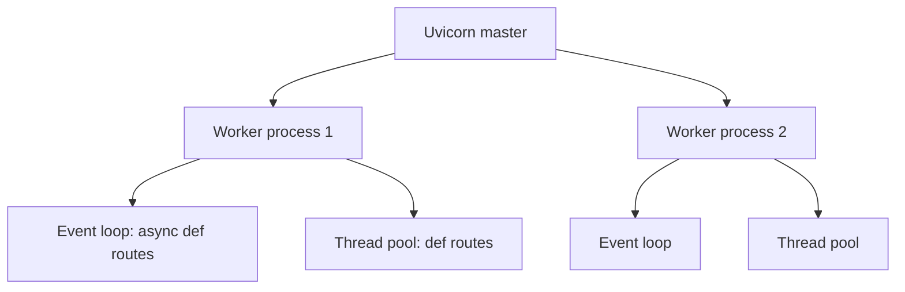

# Python for FastAPI: Deep Dive on Classes and Concurrency

## 1. How to use this guide

This guide uses one small project, a "runs" API, in every section. Each new idea is shown on the same classes, so you see one concept from several angles instead of many unrelated snippets.

### The running example

The app stores AI evaluation runs. It has four pieces, and you'll meet each of them again and again:

| Piece | What it is | First appears |
| --- | --- | --- |
| `Run` | One evaluation run: id, name, status | Section 2 |
| `RunStore` | Keeps runs in memory, like a tiny database | Section 3 |
| `RunService` | Business rules: create, start, finish a run | Section 3 |
| FastAPI routes | HTTP endpoints that call the service | Section 6 |

By the end, you'll have written this, and understood every line:

```python
store = RunStore()                       # created once per process

def get_service() -> RunService:
    return RunService(store)             # created per request

@app.post("/runs")
async def create_run(body: RunIn, service: RunService = Depends(get_service)):
    return await service.create(body.name)
```

### How to study it

1. Type every example yourself, in a file called `play.py`, and run it with `python3 play.py`.
2. Before running, predict the output. Then compare with the "Output" block. Wrong predictions are where learning happens.
3. Change one thing and run again. Each section suggests what to change.
4. After each section, explain it out loud in two sentences, as if to a teammate. If you can't, re-read that section.

Every concept appears at least three times: first a minimal example, then the runs example, then the FastAPI version.

## 2. What really happens when you write `ClassName(...)`

Writing `Run("eval-1")` does three things in order: Python creates an empty object, calls `__init__` with that object as `self` to fill it in, and gives you back the filled object. Print statements make each step visible.

### Example 1: a traced class

```python
class Run:
    print("A. class body runs (once, when Python reads the class)")

    def __init__(self, name):
        print(f"C. __init__ starts, self is object {id(self)}")
        self.name = name
        self.status = "pending"
        print("D. __init__ ends")

print("B. about to create a Run")
r = Run("eval-1")
print(f"E. got back object {id(r)}, name={r.name}")
```

Output (the id numbers will differ on your machine):

```
A. class body runs (once, when Python reads the class)
B. about to create a Run
C. __init__ starts, self is object 4371023312
D. __init__ ends
E. got back object 4371023312, name=eval-1
```

Three things to notice:

1. Line A runs before B. The class body executes once, when Python first reads the file, not when you create objects.
2. The number in C and E is the same. `self` inside `__init__` and `r` outside are the same object. `id()` shows an object's identity (its address in memory).
3. `__init__` returned nothing, yet `r` received the object. Python returns the object for you.

### Example 2: two objects, two separate states

```python
a = Run("eval-1")
b = Run("eval-2")

a.status = "running"

print(a.name, a.status)    # eval-1 running
print(b.name, b.status)    # eval-2 pending
print(a is b)              # False
```

Each call to `Run(...)` builds a new object with its own attributes. Changing `a` never touches `b`. The class is the shared blueprint; the data lives on each object.

### Example 3: where attributes actually live

Every object keeps its attributes in a dict called `__dict__`. This makes `self.name = name` concrete: it's just a dict assignment.

```python
r = Run("eval-1")
print(r.__dict__)          # {'name': 'eval-1', 'status': 'pending'}

r.owner = "gautam"         # you can add attributes later (legal, but avoid it)
print(r.__dict__)          # {'name': 'eval-1', 'status': 'pending', 'owner': 'gautam'}
```

So `self.name = name` means "put the key `name` into this object's dict". And `r.name` means "look up `name` in `r`'s dict". Setting all attributes inside `__init__` keeps every object's shape predictable.

### Example 4: variables are labels, not boxes

```python
r1 = Run("eval-1")
r2 = r1                    # no new object: a second label on the same one
r2.status = "done"
print(r1.status)           # done
print(r1 is r2)            # True
```

Assignment never copies an object. That's why passing one object to several functions lets all of them change it. This matters later: in FastAPI, if two requests receive the same object, they share its state.

### Try this

1. Remove `self.status = "pending"` from `__init__`, then read `r.status`. You get `AttributeError`, because the key was never put in the dict.
2. Print `id(a)` and `id(b)` from example 2. Different numbers, different objects.

## 3. `__init__` in depth

`__init__` should leave the object in a valid, ready-to-use state: store the inputs, check them, compute derived values, and receive the other objects it depends on. It should not do slow work like network calls.

### The four jobs of a good `__init__`

| Job | Example | Why |
| --- | --- | --- |
| 1. Store inputs | `self.name = name` | The object remembers its data |
| 2. Validate inputs | `if not name: raise ValueError(...)` | A bad object can never exist |
| 3. Compute derived values | `self.created_at = time.time()` | Values that follow from inputs or the clock |
| 4. Receive dependencies | `self.store = store` | The object uses other objects without creating them |

### Job 1 and 2: store and validate

```python
import time

class Run:
    VALID_STATUSES = {"pending", "running", "done", "failed"}   # class attribute: shared constant

    def __init__(self, run_id: int, name: str, status: str = "pending"):
        if not name.strip():
            raise ValueError("name must not be empty")
        if status not in self.VALID_STATUSES:
            raise ValueError(f"bad status: {status}")
        self.id = run_id
        self.name = name.strip()
        self.status = status
        self.created_at = time.time()       # job 3: computed, not passed in

r = Run(1, "  eval-1  ")
print(r.name)              # eval-1 (cleaned)

Run(2, "")                 # ValueError: name must not be empty
Run(3, "x", "paused")      # ValueError: bad status: paused
```

If `__init__` raises, no object is created, and the variable is never assigned. That's the goal: an invalid `Run` can't exist anywhere in your program. Pydantic models do exactly this for you, generated from type hints.

### The mutable default trap, shown

```python
class BadRun:
    def __init__(self, name, tags=[]):      # the SAME list is reused on every call
        self.name = name
        self.tags = tags

a = BadRun("a"); a.tags.append("urgent")
b = BadRun("b")
print(b.tags)              # ['urgent']  <- b never added anything!
```

The default `[]` is created once, when Python reads the `def`, and then shared by every object that uses the default. The fix:

```python
class Run:
    def __init__(self, name, tags: list[str] | None = None):
        self.name = name
        self.tags = tags if tags is not None else []   # a fresh list per object
```

### Job 4: receiving dependencies (constructor injection)

Now the running example grows. A `RunStore` holds runs. A `RunService` needs a store, so it receives one in `__init__` instead of creating it.

```python
class RunStore:
    def __init__(self):
        self._runs: dict[int, Run] = {}     # this store's own data
        self._next_id = 1

    def add(self, name: str) -> Run:
        run = Run(self._next_id, name)
        self._runs[run.id] = run
        self._next_id += 1
        return run

    def get(self, run_id: int) -> Run | None:
        return self._runs.get(run_id)


class RunService:
    def __init__(self, store: RunStore):    # receives, does not create
        self.store = store

    def create(self, name: str) -> Run:
        return self.store.add(name)

    def start(self, run_id: int) -> Run:
        run = self.store.get(run_id)
        if run is None:
            raise LookupError(f"run {run_id} not found")
        if run.status != "pending":
            raise ValueError(f"run {run_id} is {run.status}, not pending")
        run.status = "running"
        return run
```

Use it:

```python
store = RunStore()
service = RunService(store)

r = service.create("eval-1")
service.start(r.id)
print(r.status)            # running
service.start(r.id)        # ValueError: run 1 is running, not pending
```

### Why receive instead of create

Compare the two designs:

```python
# Creates its own store: hard to share, hard to test
class RunServiceA:
    def __init__(self):
        self.store = RunStore()

# Receives a store: flexible
class RunServiceB:
    def __init__(self, store: RunStore):
        self.store = store
```

1. Sharing: two `RunServiceA` objects each have a separate store, so a run created by one is invisible to the other. Two `RunServiceB` objects given the same store see the same runs.
2. Testing: with B, a test can pass in a fake store with preset data. With A, you can't swap it.
3. FastAPI does the same thing with `Depends`: it builds the dependencies and passes them in. Constructor injection is the plain-Python version of dependency injection.

### What does not belong in `__init__`

| Avoid in `__init__` | Why | Do instead |
| --- | --- | --- |
| Network or DB calls | Slow, can fail, can't be `await`ed | A separate method, or lifespan startup |
| Reading big files | Slows every object creation | Load once, pass the result in |
| Starting threads | Hidden side effects | An explicit `start()` method |

`__init__` can't be `async`. If an object needs async setup, write an `async def connect(self)` method, or an async class method that builds it:

```python
class Client:
    def __init__(self, conn):
        self.conn = conn

    @classmethod
    async def create(cls, url: str) -> "Client":
        conn = await open_connection(url)   # async work here
        return cls(conn)                     # then the normal __init__

client = await Client.create("postgres://...")
```

### Try this

1. Create two `RunService` objects with the same store. Create a run with one and `start` it with the other. It works: they share the store.
2. Now give each its own `RunStore()`. The second service raises "not found".

## 4. `self` in depth

`self` is simply the object before the dot. In `service.start(1)`, `self` is `service`. Python rewrites the call as `RunService.start(service, 1)`, which is why every method's first parameter must be there to receive it.

### Example 1: seeing the rewrite

```python
class Counter:
    def __init__(self):
        self.value = 0

    def add(self, n):
        print(f"  add called with self={id(self)}, n={n}")
        self.value += n

c1 = Counter()
c2 = Counter()
print("c1 is", id(c1), "c2 is", id(c2))

c1.add(5)                 # Python runs: Counter.add(c1, 5)
Counter.add(c2, 10)       # the same thing, written out by hand
print(c1.value, c2.value) # 5 10
```

Output:

```
c1 is 4375 c2 is 4376
  add called with self=4375, n=5
  add called with self=4376, n=10
5 10
```

The same method code ran twice, once with `self` = `c1`, once with `self` = `c2`. That's how one class definition serves every object.

### Example 2: `self` in the running example

```python
store = RunStore()
service = RunService(store)
run = service.create("eval-1")
service.start(run.id)
```

Trace `service.start(run.id)` line by line inside the method:

| Line in `start` | `self` is | What it reads or changes |
| --- | --- | --- |
| `run = self.store.get(run_id)` | `service` | `service.store` is `store`, so it calls `store.get(1)`, where `self` is now `store` |
| `if run.status != "pending"` | `service` | Reads the `Run` object's attribute |
| `run.status = "running"` | `service` | Changes the `Run` object; `store` still holds that same object, so the change is visible there too |

Notice `self` changes meaning as you move between objects: inside `RunService.start` it's the service, inside `RunStore.get` it's the store. Each method only ever sees its own object as `self`.

### Example 3: forgetting `self.`

```python
class RunStore:
    def __init__(self):
        runs = {}               # BUG: local variable, gone when __init__ ends

    def add(self, name):
        self.runs[1] = name     # AttributeError: 'RunStore' object has no attribute 'runs'
```

Without `self.`, `runs` is a local variable of `__init__` and vanishes when it returns. With `self.runs = {}`, it's stored on the object and every method can reach it.

### Example 4: object state vs class state

```python
class RunStore:
    runs = {}                   # class attribute: ONE dict shared by all stores

    def add(self, run_id, name):
        self.runs[run_id] = name

s1 = RunStore(); s2 = RunStore()
s1.add(1, "eval-1")
print(s2.runs)                  # {1: 'eval-1'}  <- s2 sees s1's data!
```

`self.runs` looks up `runs` on the object first; not finding it, it falls back to the class. Since the dict is mutable, both stores change the same one. Keep mutable data in `__init__` (`self.runs = {}`) unless sharing is truly what you want.

### Example 5: bound methods, `self` carried along

When you take a method without calling it, Python bundles the method with its object. This is called a bound method.

```python
service = RunService(RunStore())
create = service.create          # bound method: remembers self=service
run = create("eval-1")           # same as service.create("eval-1")
print(create.__self__ is service)  # True
```

FastAPI uses this. You can pass a bound method to `Depends` or register one as a route, and `self` travels with it:

```python
class RunRoutes:
    def __init__(self, service: RunService):
        self.service = service

    def get_run(self, run_id: int):
        return self.service.store.get(run_id)

routes = RunRoutes(service)
app.get("/runs/{run_id}")(routes.get_run)   # FastAPI sees only run_id; self is already bound
```

The decorator trick from the Python guide (`app.get(path)(func)`) works on a bound method just like on a plain function.

### Try this

1. In example 1, call `c1.add()` with no number. The error says `missing 1 required positional argument: 'n'`: `self` was filled in automatically; `n` wasn't.
2. In example 4, move `runs = {}` into `__init__` as `self.runs = {}` and rerun. `s2.runs` is now empty.

## 5. Inheritance and `super()` in depth

Inheritance lets a child class reuse a parent's code and change only what differs. `super().__init__(...)` runs the parent's setup first, so the child adds to it instead of replacing it. Three places you'll use it in FastAPI projects: error classes, stores, and Pydantic models.

### How attribute lookup works

When you write `obj.something`, Python searches in this order and stops at the first hit:

1. The object's own `__dict__` (set via `self.something = ...`).
2. The object's class.
3. The parent class, then its parent, up to `object`.

That search path is called the MRO (method resolution order). See it with `ChildClass.__mro__`. Overriding a method just means the child's version is found first.

### Example 1: an error hierarchy for the runs app

```python
class AppError(Exception):
    status_code = 500                       # class attribute default

    def __init__(self, message: str):
        super().__init__(message)           # let Exception store the message
        self.message = message

class NotFound(AppError):
    status_code = 404                       # override only what differs

class Conflict(AppError):
    status_code = 409

class RunNotFound(NotFound):
    def __init__(self, run_id: int):
        super().__init__(f"run {run_id} not found")   # builds the message, passes it up
        self.run_id = run_id

e = RunNotFound(7)
print(e.message, e.status_code)     # run 7 not found 404
print(isinstance(e, NotFound))      # True
print(isinstance(e, AppError))      # True
print(RunNotFound.__mro__)          # RunNotFound, NotFound, AppError, Exception, BaseException, object
```

Trace what `RunNotFound(7)` does:

1. `RunNotFound.__init__(self, 7)` runs and builds `"run 7 not found"`.
2. `super().__init__(...)` goes to the next class in the MRO. `NotFound` has no `__init__`, so Python continues to `AppError.__init__`.
3. `AppError.__init__` calls `super().__init__(message)` on `Exception`, then sets `self.message`.
4. Back in `RunNotFound.__init__`, `self.run_id = 7` is set.
5. `e.status_code` isn't on the object, so lookup finds `404` on `NotFound`.

Now one FastAPI handler covers every error in the family:

```python
@app.exception_handler(AppError)
async def handle_app_error(request, exc: AppError):
    return JSONResponse(status_code=exc.status_code, content={"error": exc.message})

# anywhere in the service:
raise RunNotFound(7)      # -> 404 {"error": "run 7 not found"}
```

### Example 2: forgetting `super().__init__`

```python
class TimedStore(RunStore):
    def __init__(self):
        self.calls = 0            # BUG: RunStore.__init__ never runs

s = TimedStore()
s.add("eval-1")               # AttributeError: no attribute '_runs'
```

The child's `__init__` replaced the parent's, so `self._runs` and `self._next_id` were never created. Fix:

```python
class TimedStore(RunStore):
    def __init__(self):
        super().__init__()        # parent sets _runs and _next_id
        self.calls = 0            # child adds its own

    def add(self, name: str) -> Run:
        self.calls += 1
        return super().add(name)  # reuse the parent's logic, then return its result
```

The rule: if you write `__init__` in a child, call `super().__init__(...)` first, unless you deliberately want to skip the parent's setup.

### Example 3: a base class that defines the shape

Often the parent says what methods must exist, and children supply the real storage. This lets the service work with any store.

```python
from abc import ABC, abstractmethod

class BaseRunStore(ABC):
    @abstractmethod
    def add(self, name: str) -> Run: ...

    @abstractmethod
    def get(self, run_id: int) -> Run | None: ...

class MemoryRunStore(BaseRunStore):          # for tests and learning
    def __init__(self):
        self._runs, self._next_id = {}, 1
    def add(self, name): ...
    def get(self, run_id): return self._runs.get(run_id)

class SqlRunStore(BaseRunStore):             # for production
    def __init__(self, db):
        self.db = db
    def add(self, name): ...
    def get(self, run_id): return self.db.get(RunRow, run_id)

BaseRunStore()        # TypeError: can't instantiate abstract class
```

`RunService(store)` works with either, because both promise the same methods. Swapping memory for SQL needs no change in the service.

### Example 4: Pydantic models inherit too

```python
from pydantic import BaseModel

class RunBase(BaseModel):          # shared fields
    name: str

class RunIn(RunBase):              # request: just the shared fields
    pass

class RunOut(RunBase):             # response: shared fields plus server-set ones
    id: int
    status: str

RunOut(id=1, name="eval-1", status="pending")
```

`RunOut` has no `__init__` of its own, yet takes keyword arguments. `BaseModel` generates the constructor from every field in the inheritance chain.

### Try this

1. Print `TimedStore.__mro__`. Then remove `super().add(name)` and return `None`: callers break because the run was never stored.
2. Add `class Forbidden(AppError): status_code = 403` and raise it from a route. The same handler returns 403.

## 6. Object lifetimes in FastAPI

Where you create an object decides how long it lives and who shares it. There are three places, and choosing the wrong one causes most subtle FastAPI bugs.

| Where it's created | Created | Shared by | Use for |
| --- | --- | --- | --- |
| Module level (top of a file) | Once per process, at import | Every request in that process | Settings, the app, stateless helpers |
| Lifespan startup | Once per process, at startup | Every request in that process | Clients needing setup/cleanup: HTTP clients, DB engine, ML models |
| Inside a dependency | Once per request | Only that request | DB sessions, current user, per-request services |

### Example 1: seeing the lifetimes with prints

```python
from fastapi import FastAPI, Depends

print("1. module level: runs once")
store = RunStore()                          # one store for the whole process

def get_service() -> RunService:
    print("3. dependency: runs on every request")
    return RunService(store)                # new service, same store

class RunIn(BaseModel):
    name: str

app = FastAPI()

@app.post("/runs")
def create_run(body: RunIn, service: RunService = Depends(get_service)):
    print(f"4. route: service={id(service)}, store={id(service.store)}")
    run = service.create(body.name)
    return {"id": run.id, "name": run.name, "status": run.status}

print("2. module finished loading")
```

Start the server and send two requests. Output:

```
1. module level: runs once
2. module finished loading
3. dependency: runs on every request
4. route: service=4401, store=4200
3. dependency: runs on every request
4. route: service=4488, store=4200
```

The service id changes per request; the store id stays the same. So runs created by request 1 are visible to request 2, because they share the store. That's the complete running example from section 1, now working.

### Example 2: the same app with lifespan

```python
from contextlib import asynccontextmanager

@asynccontextmanager
async def lifespan(app: FastAPI):
    app.state.store = RunStore()            # created at startup
    print("store ready")
    yield
    print("shutting down")                  # cleanup would go here

app = FastAPI(lifespan=lifespan)

def get_service(request: Request) -> RunService:
    return RunService(request.app.state.store)
```

The behavior is identical, but the store's creation and cleanup are explicit, and tests can start a fresh app with a fresh store.

### Example 3: the wrong lifetime, two bugs

Bug A, store created per request:

```python
def get_service() -> RunService:
    return RunService(RunStore())    # new empty store every request
```

Request 1 creates run 1; request 2 asks for run 1 and gets 404. Each request had its own empty store.

Bug B, per-request data stored module-level:

```python
current_user = None                  # module level: shared by ALL requests

@app.get("/me")
def me(user: str = Depends(get_current_user)):
    global current_user
    current_user = user              # request A sets "gautam"...
    do_slow_thing()                  # ...meanwhile request B sets "surya"...
    return {"user": current_user}    # ...and A returns "surya"
```

Two requests running at the same time overwrite each other. Per-request data belongs in parameters and dependencies, never in module-level variables. Section 11 goes deeper on why these overlaps happen.

### Rules of thumb

1. Read-only after creation (settings, config): module level, or `@lru_cache` function.
2. Expensive, shared, needs cleanup (HTTP client, engine, model): lifespan.
3. Anything about this request (user, DB session, request ID): a dependency.
4. Shared and mutable (like `RunStore`): works in one process for learning, but breaks with several workers. Section 11 explains why and what to use instead.

## 7. Concurrency from zero

Concurrency means handling many tasks by switching between them; parallelism means literally running them at the same instant on several CPU cores. Python offers three tools (processes, threads, async), and which one fits depends on whether your work waits (I/O-bound) or computes (CPU-bound).

### The kitchen analogy

Imagine a restaurant kitchen with orders coming in.

1. One chef, one order at a time, standing and watching the rice boil: no concurrency. Slow.
2. One chef who starts the rice, chops vegetables while it boils, then checks the oven: concurrency. One person, many tasks in progress, switching while something waits. This is async.
3. Several chefs in one kitchen, sharing the same fridge and knives: threads. They can bump into each other over shared tools.
4. Several separate kitchens, each with its own chef and fridge: processes. True parallel work, no sharing, but more expensive to run.

### Process vs thread vs async task

|  | Process | Thread | Async task (coroutine) |
| --- | --- | --- | --- |
| What it is | A running program with its own memory | A path of execution inside a process | A function that pauses at `await` |
| Memory | Separate from other processes | Shared with other threads in the process | Shared, one thread |
| Who switches | The OS | The OS, at any moment | Your code, only at `await` |
| Cost to create | High (MBs) | Medium | Very low (KBs) |
| Runs on several cores at once | Yes | Not for Python code (GIL) | No |
| In FastAPI | Uvicorn workers | Thread pool for `def` routes | `async def` routes |

### The GIL

CPython (the standard Python) has a Global Interpreter Lock: only one thread runs Python bytecode at a time within a process. Consequences:

1. Threads do not speed up CPU-heavy Python code. Two threads computing in pure Python take about as long as one.
2. Threads do help with waiting. While a thread waits on the network, a file or `time.sleep`, it releases the GIL and another thread runs.
3. Libraries like NumPy release the GIL inside their heavy C code, so they can use several cores.
4. For true parallel Python computation, use several processes. Each has its own GIL.

Python 3.13 added an optional experimental "free-threaded" build without the GIL. The standard build still has it, so plan with the GIL in mind.

### I/O-bound vs CPU-bound

This single question decides the right tool:

| Your work mostly... | Type | Examples | Best tool |
| --- | --- | --- | --- |
| Waits for something | I/O-bound | DB queries, HTTP calls to an LLM API, reading files, WebSockets | async, or threads |
| Calculates | CPU-bound | Image resizing, parsing huge files, local ML inference in pure Python, hashing many passwords | Processes, or a job queue |

Most web APIs are I/O-bound: a typical request spends 5 ms computing and 200 ms waiting on a database or another service. That's why async web frameworks like FastAPI handle many requests with few resources.

### Example: why waiting work benefits from concurrency

Three calls that each wait 1 second:

| Approach | Total time | Why |
| --- | --- | --- |
| One after another | about 3 s | Each waits fully before the next starts |
| Three threads | about 1 s | All three wait at the same time |
| Three async tasks | about 1 s | All three wait at the same time, on one thread |
| Three processes | about 1 s, plus startup cost | Works, but heavy for simple waiting |

Now three calls that each compute for 1 second in pure Python:

| Approach | Total time | Why |
| --- | --- | --- |
| One after another | about 3 s | Baseline |
| Three threads | about 3 s | The GIL lets only one compute at a time |
| Three async tasks | about 3 s | Computation never hits an `await`, so no switching |
| Three processes | about 1 s on 3+ cores | Each process has its own GIL and core |

Sections 8 and 9 let you run both experiments yourself.

## 8. Threads in Python

A thread runs a function alongside your main code, sharing the same memory. Threads are simple for waiting work, but shared memory means two threads can corrupt the same data unless you protect it with a lock.

### Example 1: sequential vs threads, measured

```python
import threading, time

def fake_llm_call(i):
    print(f"  call {i} start")
    time.sleep(1)                 # waiting, like a network call
    print(f"  call {i} done")

start = time.perf_counter()
for i in range(3):
    fake_llm_call(i)
print(f"sequential: {time.perf_counter() - start:.1f}s")

start = time.perf_counter()
threads = [threading.Thread(target=fake_llm_call, args=(i,)) for i in range(3)]
for t in threads: t.start()       # begin running
for t in threads: t.join()        # wait until each finishes
print(f"threads: {time.perf_counter() - start:.1f}s")
```

Output:

```
  call 0 start
  call 0 done
  call 1 start
  call 1 done
  call 2 start
  call 2 done
sequential: 3.0s
  call 0 start
  call 1 start
  call 2 start
  call 0 done
  call 2 done
  call 1 done
threads: 1.0s
```

With threads, all three start before any finishes, and the "done" order can vary between runs: the OS decides who continues when. `target=` is the function (not called; no parentheses) and `args=` its arguments as a tuple, `(i,)` with a comma.

### Example 2: ThreadPoolExecutor, the easier way

Creating threads by hand is rare. A pool keeps a fixed number of threads and gives you results back.

```python
from concurrent.futures import ThreadPoolExecutor

def fetch(i):
    time.sleep(1)
    return f"result {i}"

with ThreadPoolExecutor(max_workers=3) as pool:
    results = list(pool.map(fetch, range(6)))   # 6 jobs, 3 threads
print(results)       # ['result 0', ..., 'result 5'] in order, after about 2s
```

Six one-second jobs on three threads take about 2 seconds: two rounds of three. FastAPI keeps a pool exactly like this for your `def` routes (section 10).

### Example 3: a race condition, made visible

The running example's `RunStore.add` reads `_next_id`, then increments it. Two threads can interleave between those steps:

```python
class RunStore:
    def __init__(self):
        self._runs = {}
        self._next_id = 1

    def add(self, name):
        run_id = self._next_id        # 1. read
        time.sleep(0.001)             # (simulates any small delay)
        self._next_id = run_id + 1    # 2. write
        self._runs[run_id] = name
        return run_id

store = RunStore()
with ThreadPoolExecutor(max_workers=10) as pool:
    ids = list(pool.map(store.add, [f"run-{i}" for i in range(100)]))

print(len(ids), len(set(ids)))       # e.g. 100 12  <- many duplicate ids!
print(len(store._runs))              # e.g. 12      <- runs overwritten and lost
```

The step-by-step failure:

| Time | Thread A | Thread B | `_next_id` |
| --- | --- | --- | --- |
| 1 | reads 5 |  | 5 |
| 2 |  | reads 5 | 5 |
| 3 | writes 6 |  | 6 |
| 4 |  | writes 6 | 6 |
| 5 | stores run 5 | stores run 5, overwriting A's | 6 |

Both got id 5. This is a race condition: the result depends on timing. The delay makes it happen every time; without it, the bug is rare, which is worse because it slips through testing.

### Example 4: fixing it with a Lock

```python
class RunStore:
    def __init__(self):
        self._runs = {}
        self._next_id = 1
        self._lock = threading.Lock()    # one lock per store, created in __init__

    def add(self, name):
        with self._lock:                 # only one thread inside at a time
            run_id = self._next_id
            time.sleep(0.001)
            self._next_id = run_id + 1
            self._runs[run_id] = name
        return run_id

# rerun the same test:
print(len(ids), len(set(ids)))       # 100 100
```

`with self._lock:` makes other threads wait at the door until the current one leaves the block. The read and the write now happen as one unit. The cost: threads queue up, so keep locked blocks short.

### When you need a lock

1. Several threads change the same object (counter, dict, list) and the change is more than one step (read, then write).
2. You do not need a lock for data each thread owns alone, like local variables inside a function.
3. In FastAPI, anything module-level or lifespan-level that `def` routes modify is shared between threads.

## 9. async in depth

Async runs many tasks on one thread using an event loop. Each `await` is a point where a task says "I'm waiting, run someone else". If a task never awaits, or blocks without awaiting, every other task freezes.

### The event loop, in one picture

The event loop is a scheduler with a to-do list. It repeats:

1. Take the next task that's ready to run.
2. Run it until it hits an `await` on something not finished yet.
3. Park that task, note what it's waiting for.
4. When the thing it waited for completes (network reply, timer), mark the task ready again.
5. Go to step 1.

Only one task runs at any instant. Speed comes from never sitting idle during waits.

### Example 1: the same three calls, async

```python
import asyncio, time

async def fake_llm_call(i):
    print(f"  call {i} start")
    await asyncio.sleep(1)        # "I'm waiting; loop, run others"
    print(f"  call {i} done")
    return i

async def main():
    start = time.perf_counter()
    await fake_llm_call(0)        # one at a time
    await fake_llm_call(1)
    print(f"one by one: {time.perf_counter() - start:.1f}s")

    start = time.perf_counter()
    results = await asyncio.gather(fake_llm_call(0), fake_llm_call(1), fake_llm_call(2))
    print(f"gather: {time.perf_counter() - start:.1f}s, results={results}")

asyncio.run(main())
```

Output:

```
  call 0 start
  call 0 done
  call 1 start
  call 1 done
one by one: 2.0s
  call 0 start
  call 1 start
  call 2 start
  call 0 done
  call 1 done
  call 2 done
gather: 1.0s, results=[0, 1, 2]
```

The same speedup as threads in section 8, but on a single thread, with no locks needed for simple code, because switching only happens at `await`.

### Example 2: what calling an async function actually returns

```python
async def get_run():
    return {"id": 1}

x = get_run()                 # nothing ran yet!
print(x)                      # <coroutine object get_run at 0x...>

result = asyncio.run(get_run())    # outside async code: run it
# inside async code:  result = await get_run()
```

Calling an `async def` gives a coroutine, a paused recipe. Only `await` (or `asyncio.run`, or `gather`) actually runs it. Forgetting `await` is the classic async bug; Python warns "coroutine was never awaited".

### Example 3: blocking the loop, the most important async mistake

```python
async def bad_call(i):
    print(f"  bad {i} start")
    time.sleep(1)                 # blocking: does NOT give up the loop
    print(f"  bad {i} done")

async def main():
    start = time.perf_counter()
    await asyncio.gather(bad_call(0), bad_call(1), bad_call(2))
    print(f"gather with time.sleep: {time.perf_counter() - start:.1f}s")

asyncio.run(main())
```

Output:

```
  bad 0 start
  bad 0 done
  bad 1 start
  bad 1 done
  bad 2 start
  bad 2 done
gather with time.sleep: 3.0s
```

`gather` didn't help at all. `time.sleep` holds the only thread, so the loop can't switch. In a FastAPI server, this means every other request, on that worker, waits too. Common blocking calls to watch for inside `async def`:

| Blocking (don't use in `async def`) | Async alternative |
| --- | --- |
| `time.sleep(1)` | `await asyncio.sleep(1)` |
| `requests.get(url)` | `await httpx.AsyncClient().get(url)` |
| Sync DB session queries | Async engine and `AsyncSession` |
| Official LLM SDK sync client | The SDK's async client (e.g. `AsyncAnthropic`, `AsyncOpenAI`) |
| Heavy CPU loop | Move it off the loop (section 12) |

### Example 4: async in the running example

If the store is backed by something async (a real database, a remote API), the service methods become async too:

```python
class AsyncRunService:
    def __init__(self, store: RunStore, http: httpx.AsyncClient):
        self.store = store
        self.http = http

    async def create(self, name: str) -> Run:
        run = self.store.add(name)                              # quick, in memory
        await self.http.post("https://hooks.example.com/runs",  # waits: other requests run meanwhile
                             json={"id": run.id})
        return run
```

`__init__` stays sync (it just stores objects); the method that waits is async. Once a function awaits, every caller up the chain must be `async` and `await` it, all the way up to the FastAPI route.

### Example 5: async shared state still needs care

Async avoids interruptions between awaits, but not across them:

```python
async def add(self, name):
    run_id = self._next_id
    await save_to_db(run_id, name)    # switch point: another task may run add() here
    self._next_id = run_id + 1        # stale value: duplicate ids again
```

Fix it by not awaiting in the middle of a read-then-write, or with `asyncio.Lock()` (use `async with self._lock:`). Note that `threading.Lock` is the wrong lock for async code.

## 10. How FastAPI runs your code

FastAPI runs `async def` routes directly on the event loop, and runs plain `def` routes in a thread pool so they can't block the loop. Uvicorn workers are separate processes, each with its own loop and pool. Dependencies follow the same rule as routes.

### The layers



| Layer | What it is | How many | Shares memory with |
| --- | --- | --- | --- |
| Worker | A separate OS process running your whole app | `--workers N` (default 1) | Nothing; each has its own copy of every module-level object |
| Event loop | Runs all `async def` routes and dependencies | 1 per worker | Everything in its worker |
| Thread pool | Runs `def` routes and dependencies | About 40 threads per worker by default | Everything in its worker |

### The rule

| You write | FastAPI does | Safe to call blocking code? |
| --- | --- | --- |
| `async def route()` | `await route()` on the event loop | No: it freezes every request on that worker |
| `def route()` | Runs it in a pool thread | Yes: only that thread waits |
| `async def dependency()` | Awaits it on the loop | No |
| `def dependency()` | Runs it in a pool thread | Yes |

### The experiment: four versions of one slow route

Put all four in one app and run it with a single worker: `uvicorn main:app --workers 1`.

```python
import time, asyncio
from fastapi import FastAPI

app = FastAPI()

@app.get("/a")                     # A: async + non-blocking wait   (correct)
async def a():
    await asyncio.sleep(1)
    return {"route": "a"}

@app.get("/b")                     # B: async + BLOCKING wait        (bug)
async def b():
    time.sleep(1)
    return {"route": "b"}

@app.get("/c")                     # C: sync + blocking wait         (fine, uses pool)
def c():
    time.sleep(1)
    return {"route": "c"}

@app.get("/d")                     # D: sync + CPU work              (holds GIL)
def d():
    total = sum(i * i for i in range(20_000_000))   # about 1s of pure Python
    return {"route": "d"}
```

Fire 10 requests at the same time at each route (with a load tool such as `hey -n 10 -c 10 http://localhost:8000/a`, or a small `asyncio.gather` script using `httpx.AsyncClient`). Typical results:

| Route | 10 concurrent requests take | Why |
| --- | --- | --- |
| A: `async` + `await asyncio.sleep` | about 1 s | All 10 wait together on the loop |
| B: `async` + `time.sleep` | about 10 s | Each blocks the loop; requests run one by one |
| C: `def` + `time.sleep` | about 1 s | 10 pool threads wait in parallel |
| D: `def` + CPU loop | about 10 s | GIL: only one thread computes at a time |

Also, while B's requests run, try `curl /a` in another terminal. It hangs too, because B froze the whole loop. That's the real damage: one bad route slows every route on the worker.

### Reading the table

1. A and C are both correct. Pick by library: async libraries go in `async def`, blocking libraries in `def`.
2. B is the bug to never write. It's easy to do by accident: calling `requests`, a sync SDK, or a sync DB session inside `async def`.
3. D shows that threads don't help CPU work. More workers (processes) do: with `--workers 4` on a 4-core machine, D's 10 requests take about 3 s.
4. The thread pool has a limit (about 40). With 100 concurrent requests to C, 40 run and 60 queue. Async routes like A have no such limit.

### The running example, both ways

```python
# Sync version: service methods are plain functions, route is def
@app.post("/runs")
def create_run(body: RunIn, service: RunService = Depends(get_service)):
    return service.create(body.name)          # runs in a pool thread

# Async version: service awaits an HTTP call, route is async def
@app.post("/runs")
async def create_run(body: RunIn, service: AsyncRunService = Depends(get_async_service)):
    return await service.create(body.name)    # runs on the loop, awaits the webhook
```

The sync version runs in a thread, so the `RunStore` lock from section 8 matters there. The async version runs on one thread, so the store is safe as long as `add` doesn't await in the middle.

## 11. Shared state bugs: threads, workers, and the in-memory store

Any module-level mutable object, like `RunStore` or the `refresh_store = {}` dict from the cookie guide, works in development and breaks in production. Threads corrupt it without locks, and separate worker processes each get their own private copy.

### Bug 1: threads, fixed with a lock

Covered in section 8. `def` routes run in pool threads, so two requests can run `store.add` at once. A `threading.Lock` in the store fixes it within one process.

### Bug 2: workers, which no lock can fix

Run the section 6 app with two workers: `uvicorn main:app --workers 2`. Then:

```bash
curl -X POST localhost:8000/runs -H 'content-type: application/json' -d '{"name":"eval-1"}'
# {"id": 1, ...}   handled by worker 1
curl localhost:8000/runs/1
# 404 half the time: handled by worker 2, whose store is empty
curl -X POST localhost:8000/runs -d '{"name":"eval-2"}' -H 'content-type: application/json'
# {"id": 1, ...}   worker 2 also starts counting at 1: duplicate id
```

Why: each worker is a separate process. Each one imports `main.py` and runs `store = RunStore()` itself. Processes don't share memory, so there are now two stores that know nothing about each other. The load balancer sends each request to whichever worker is free.

|  | 1 worker | 2+ workers | 2+ servers or containers |
| --- | --- | --- | --- |
| In-memory dict or `RunStore` | Works (with a lock for `def` routes) | Broken: split data | Broken: split data |
| `threading.Lock` | Protects the data | Protects each copy only | Same |
| Redis or a database | Works | Works | Works |

### The same trap in the cookie guide

The refresh token example used:

```python
refresh_store = {}        # learning only: use a DB or Redis
```

With two workers, login on worker 1 saves the refresh token in worker 1's dict. The next refresh may hit worker 2, which has never seen it, returns 401, and logs the user out at random. That's why the comment said "learning only".

### The fix: move shared state out of the process

```python
# Redis version of the refresh store (pip install redis)
import redis.asyncio as redis

class RefreshStore:
    def __init__(self, client: redis.Redis):
        self.client = client                             # constructor injection again

    async def save(self, token_hash: str, user: str, ttl: int) -> None:
        await self.client.set(f"refresh:{token_hash}", user, ex=ttl)   # auto-expires

    async def pop(self, token_hash: str) -> str | None:
        return await self.client.getdel(f"refresh:{token_hash}")        # read and delete, atomically
```

1. Every worker and every server talks to the same Redis, so they share one view.
2. `getdel` reads and deletes in one atomic step inside Redis, which is the rotation guarantee (single use) that `dict.pop` gave in one process.
3. For the runs data, a database plays the same role, with transactions guarding multi-step changes.

### A checklist for any module-level object

Ask three questions about everything created at the top of a file or in lifespan:

1. Does any request change it after startup? If no (settings, a read-only model), it's safe.
2. If yes, do `def` routes change it? Then it needs a lock, even with one worker.
3. If yes, will you ever run more than one worker or server? Then it must live outside the process: Redis, a database, or a queue.

Caches are the one acceptable exception: a per-process cache is fine if every worker can rebuild the data on its own and slight differences between workers don't matter.

## 12. CPU-heavy work and blocking libraries

Three tools move work off the event loop, depending on its size: the thread pool for blocking I/O you can't make async, a process pool for heavy computation, and a task queue for anything long.

| Work | Duration | Tool |
| --- | --- | --- |
| A blocking library call (sync SDK, `requests`) inside `async def` | Seconds | `run_in_threadpool` / `asyncio.to_thread` |
| Pure-Python computation | Up to a few seconds | `ProcessPoolExecutor` |
| Long jobs: evals, reports, batch embeddings | Seconds to hours | Task queue (Celery, RQ, Arq) plus a status endpoint |

### Tool 1: a blocking call inside an async route

Sometimes an async route must call a sync-only library. Hand it to a thread so the loop stays free:

```python
from fastapi.concurrency import run_in_threadpool

def score_with_sync_sdk(text: str) -> float:
    return sync_client.score(text)      # blocking network call

@app.post("/score")
async def score(body: ScoreIn):
    result = await run_in_threadpool(score_with_sync_sdk, body.text)
    return {"score": result}
```

`asyncio.to_thread(func, arg)` does the same in plain Python. This is exactly what FastAPI does automatically for `def` routes; here you do it for one call.

### Tool 2: CPU work in a process pool

Threads don't help CPU work (GIL), so use processes:

```python
import asyncio
from concurrent.futures import ProcessPoolExecutor

def summarize_numbers(n: int) -> int:           # must be a top-level function
    return sum(i * i for i in range(n))

@asynccontextmanager
async def lifespan(app: FastAPI):
    app.state.cpu_pool = ProcessPoolExecutor(max_workers=2)   # created once
    yield
    app.state.cpu_pool.shutdown()

app = FastAPI(lifespan=lifespan)

@app.get("/heavy")
async def heavy(request: Request, n: int = 20_000_000):
    loop = asyncio.get_running_loop()
    result = await loop.run_in_executor(request.app.state.cpu_pool, summarize_numbers, n)
    return {"result": result}
```

1. The pool is created in lifespan (once per worker), not per request, because starting processes is expensive.
2. The function runs in another process, so arguments and results are copied (pickled) across. Keep them small, and the function must be defined at module level.
3. The event loop stays free the whole time: other requests keep flowing.

### Tool 3: long jobs go to a queue

For anything longer than a few seconds, an HTTP request shouldn't wait. The standard pattern, using the running example:

1. `POST /runs` creates a run with `status="pending"`, puts a job on a queue, and returns 202 with the run id immediately.
2. A separate worker program takes the job, runs the evaluation, and updates the run to `running`, then `done` or `failed`.
3. The client polls `GET /runs/{id}`, or subscribes via WebSocket or Server-Sent Events, to see progress.

```python
@app.post("/runs", status_code=202)
async def create_run(body: RunIn, service: RunService = Depends(get_service)):
    run = await service.create(body.name)     # saved as pending in the database
    await queue.enqueue("run_eval", run.id)   # hand the work to the queue worker
    return {"id": run.id, "status": run.status}
```

The queue and its worker survive server restarts and retry failures, unlike `BackgroundTasks`. This is also why `RunService.start` checks `status == "pending"` (section 3): a retried job must not start the same run twice.

### Decision guide

1. Is the code waiting on something? Use `async def` with an async library. No async library? Use a `def` route, or `run_in_threadpool`.
2. Is it computing for under a few seconds? Process pool.
3. Will it take longer, or must it survive restarts? Task queue.
4. Need more total capacity? Add workers or containers, and keep shared state in Redis or the database.

## 13. Cheat sheet and exercises

The whole guide in one place, then exercises that build the running example from scratch. Do the exercises without looking back first; check the sections only when stuck.

### Classes cheat sheet

| You write | Python does |
| --- | --- |
| `r = Run("eval-1")` | Creates an empty object, calls `Run.__init__(obj, "eval-1")`, returns `obj` |
| `self.name = name` | Puts `name` into this object's `__dict__` |
| `r.start()` | Calls `Run.start(r)`: `r` becomes `self` |
| `runs = {}` in the class body | One dict shared by every object (usually a bug if mutable) |
| `self.runs = {}` in `__init__` | A fresh dict per object |
| `super().__init__(x)` | Runs the parent's setup on the same object |
| `RunService(store)` | Constructor injection: receive dependencies, don't create them |

### Concurrency cheat sheet

| Situation | Do |
| --- | --- |
| Route waits on an async library | `async def` + `await` |
| Route uses a blocking library | Plain `def` (runs in the thread pool) |
| One blocking call in an async route | `await run_in_threadpool(func, args)` |
| CPU work, a few seconds | `ProcessPoolExecutor` created in lifespan |
| Long or must-survive-restart work | Task queue + status endpoint |
| Threads change shared data | `threading.Lock` |
| Async tasks change shared data across an `await` | `asyncio.Lock` |
| More than one worker or server | Shared state in Redis or a database, never module-level dicts |
| Inside `async def`, never | `time.sleep`, `requests`, sync DB, sync SDK clients |

### Explain it in two sentences

Practice saying these out loud:

1. `__init__`: "It runs automatically when an object is created, with the new object as `self`, and its job is to put the object in a valid starting state. It stores and validates inputs, computes derived values, and receives dependencies, but does no slow work."
2. `self`: "It's the object before the dot; `obj.method(x)` is really `Class.method(obj, x)`. That's how one method definition serves many objects."
3. Async vs threads: "Async switches tasks on one thread only at `await`, so it's cheap but freezes if you block. Threads are switched by the OS at any time, so blocking is fine but shared data needs locks."
4. Workers: "Each worker is a separate process with its own memory, so in-memory state isn't shared. Shared state goes in Redis or a database."

### Exercises

1. Write `Run`, `RunStore` and `RunService` from memory, with validation in `Run.__init__` and constructor injection in `RunService`. Add `finish(run_id, ok: bool)` that moves a running run to `done` or `failed`.
2. Add prints to `__init__` and a method, create two objects, and explain from the ids which `self` is which.
3. Write `TimedStore(RunStore)` that counts calls, first without `super().__init__()` (see the error), then with it.
4. Build the `AppError` family with `RunNotFound` and `InvalidTransition` (409), plus one FastAPI exception handler for all of them.
5. Reproduce the race condition from section 8 with 100 threads, then fix it with a lock, and print the duplicate count before and after.
6. Rewrite the three-call timing with `asyncio.gather`, then replace `asyncio.sleep` with `time.sleep` and explain the new timing.
7. Build the four-route experiment from section 10 and measure each with 10 concurrent requests. Write down your numbers next to the table.
8. Run the runs API with `--workers 2`, create and read runs, and observe the split data. Then move the store to SQLite or Redis and show that it's fixed.

Finishing exercise 8 means you understand the main classes and concurrency ideas behind every FastAPI service you'll work on.
