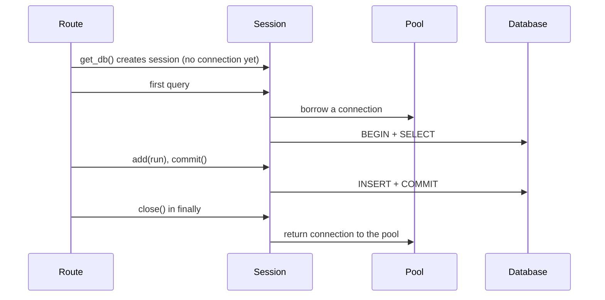

# Python Backend Foundations: Imports, DB, Production, Interviews

## 1. How import really works

Yes: importing a module runs its top-level code, line by line, the first time only. The result is a module object cached in `sys.modules`; every later import anywhere gets that same object without running anything again. So after startup, all your modules' top-level objects already exist in memory.

### What `import runs` does, step by step

1. Check the cache `sys.modules`. If `"runs"` is already there, skip to step 5.
2. Find the file: search the folders in `sys.path` (your project folder, then installed packages) for `runs.py` or a `runs/` package.
3. Create an empty module object and put it in `sys.modules["runs"]` right away.
4. Execute the file's top-level code, top to bottom, inside that module object. Every `def`, `class`, and assignment at the top level becomes an attribute of the module.
5. Bind the name `runs` in the importing file to the module object.

### Example 1: seeing it run once

```python
# store.py
print("store.py is running")
class RunStore:
    def __init__(self):
        print("RunStore created")
        self.runs = {}
store = RunStore()
```

```python
# main.py
print("main start")
import store
import store               # second import: cache hit, prints nothing
from store import store as s
print(s is store.store)    # True: same object
```

Output:

```
main start
store.py is running
RunStore created
True
```

Three imports, one execution. That's why a module-level `store = RunStore()` is effectively a singleton per process, and why the Deep Dive guide warned about module-level mutable state.

### Example 2: what "already in memory" means

When Uvicorn starts with `uvicorn app.main:app`:

1. It imports `app.main`. That file imports routers, which import services, which import models and settings.
2. Every one of those files runs its top-level code once: classes are defined, `app = FastAPI()` is created, `engine = create_engine(...)` is created, decorators like `@router.get` run and register routes.
3. When the first request arrives, all of that already exists. Only your route function and its dependencies run per request.

So top-level code is startup code. Keep it cheap and side-effect-free: no network calls, no reading huge files, no connecting to the DB at import (create the engine, but let it connect lazily, or use lifespan).

### Example 3: `import x` vs `from x import y`

```python
# config.py
DEBUG = False

# a.py
import config
from config import DEBUG

config.DEBUG = True        # change the module's attribute
print(config.DEBUG)        # True  (reads the module's current value)
print(DEBUG)               # False (a copy of the name, taken at import time)
```

`from config import DEBUG` creates a new name `DEBUG` in `a.py` pointing at the value as it was then. Rebinding `config.DEBUG` later doesn't update it. For values that can change, import the module and read `config.DEBUG`. This also matters in tests when you patch things: patch where the name is used.

### Example 4: circular imports

```python
# a.py
from b import helper_b
def helper_a(): ...

# b.py
from a import helper_a     # ImportError: cannot import name 'helper_a' (partially initialized module)
def helper_b(): ...
```

What happened: `a` started running, put itself in `sys.modules` half-built, then imported `b`. `b` asked `a` for `helper_a`, but `a` hadn't reached that line yet. Fixes, best first:

1. Restructure: move the shared thing into a third module both import (common: `schemas.py`, `deps.py`).
2. Import the module, not the name: `import a`, and use `a.helper_a()` inside a function, so it's looked up later.
3. Import inside the function that needs it, as a last resort.
4. For type hints only: `from typing import TYPE_CHECKING` with `if TYPE_CHECKING: from a import X`.

### Python vs Dart

|  | Python | Dart |
| --- | --- | --- |
| When does a file's code run | At first import, top to bottom | Nothing runs at import; only `main()` starts execution |
| Top-level variables | Created when the module is imported | Lazily initialized on first access |
| Top-level statements | Allowed (`print(...)`, function calls) | Not allowed outside functions |
| Cache | `sys.modules`, one module object per process | Libraries loaded once by the VM |
| Circular imports | Can fail with partially initialized modules | Allowed; no top-level execution to go wrong |

The big difference: in Dart, importing a library is just making names available. In Python, importing is running code. That's why `if __name__ == "__main__":` exists: to keep script-only code from running when the file is imported.

### Reloading

Python never re-runs a module automatically. `uvicorn --reload` works by killing the whole process and starting a fresh one when files change, which re-imports everything from scratch.

### Running code only when needed, not at import

Anything inside a function, method or class `__init__` waits until it's called. So the rule is simple: keep the module's top level to definitions, and move actual work into something you call. Six patterns, from simplest to most specific:

1. **Wrap it in a function.** The work happens when you call it, not at import.

   ```python
   # Runs at import (bad for slow work):
   model = load_big_model()
   
   # Runs only when called:
   def get_model():
       return load_big_model()
   ```
2. **Create once, on first use, with `@lru_cache`.** The first call does the work; later calls return the cached result. This is the lazy singleton pattern used for settings.

   ```python
   from functools import lru_cache
   
   @lru_cache
   def get_model():
       print("loading model...")      # prints only on the first call
       return load_big_model()
   
   get_model()   # loading model...
   get_model()   # instant, same object
   ```
3. **Put startup work in FastAPI's lifespan.** It runs when the server starts serving, not when a test or script merely imports the module, and it gets a matching shutdown.

   ```python
   @asynccontextmanager
   async def lifespan(app: FastAPI):
       app.state.model = load_big_model()   # at server start
       yield
   ```
4. **Import inside the function** for heavy or optional libraries, so importing your module stays fast:

   ```python
   def make_pdf_report(run):
       import reportlab              # imported only when a PDF is actually made
       ...
   ```
5. **Guard script-only code** with `if __name__ == "__main__":` so it runs with `python file.py` but not on import.
6. **Keep work in `__init__` or methods**, and create the object when needed. Defining a class runs only its body; `__init__` waits until an object is created (see the OOP guide, section 2).

| You want | Use |
| --- | --- |
| Run every time it's needed | A plain function |
| Run once, the first time it's needed | `@lru_cache` function |
| Run once, when the server starts, with cleanup | Lifespan |
| Avoid loading a heavy library unless used | Import inside the function |
| Only when the file is executed directly | `if __name__ == "__main__":` |

## 2. Python's execution model

Everything in Python is an object, and variables are names bound to objects. Four ideas explain most confusing behavior: names vs objects, mutable vs immutable, scope (LEGB), and closures.

### Names point at objects

```python
a = [1, 2]
b = a            # b points at the same list
b.append(3)
print(a)         # [1, 2, 3]

x = 5
y = x
y = y + 1        # y now points at a NEW int object, 6
print(x)         # 5
```

`b.append(3)` changed the object both names point at. `y = y + 1` made `y` point at a different object. The rule: `=` never copies; it binds a name.

### Mutable vs immutable

| Immutable (can't change in place) | Mutable (can change in place) |
| --- | --- |
| `int`, `float`, `str`, `bool`, `tuple`, `None`, `frozenset` | `list`, `dict`, `set`, most class instances |

Why it matters:

1. Passing a mutable object to a function lets the function change your data.
2. Mutable default arguments are shared between calls (the `tags=[]` trap).
3. Only immutable, hashable values can be dict keys or set members: `{(1, 2): "ok"}` works, `{[1, 2]: "x"}` raises `TypeError`.

### Function arguments: passed by object reference

```python
def add_tag(tags):
    tags.append("new")     # changes the caller's list

def replace_tags(tags):
    tags = ["new"]         # rebinds the local name only

t = ["a"]
add_tag(t);      print(t)  # ['a', 'new']
replace_tags(t); print(t)  # ['a', 'new']  (unchanged)
```

This is a very common interview question. Answer: "Python passes references to objects. Mutating the object is visible to the caller; rebinding the parameter isn't."

### Scope: LEGB

When Python looks up a name, it searches four places in order:

1. Local: inside the current function.
2. Enclosing: inside any outer function (for nested functions).
3. Global: the module's top level.
4. Built-in: `print`, `len`, `dict`, and so on.

```python
count = 0                  # global

def bump():
    count += 1             # UnboundLocalError: assigning makes count local

def bump_ok():
    global count           # explicitly use the module-level name
    count += 1
```

Assigning to a name inside a function makes it local for the whole function. `global` (and `nonlocal` for enclosing functions) overrides that. Needing `global` in app code is usually a design smell; pass values or use an object.

### Closures: functions that remember

```python
def make_checker(role):
    def check(user_role):
        return user_role == role     # remembers role from the outer call
    return check

is_admin = make_checker("admin")
is_admin("admin")                    # True
```

The inner function keeps a reference to `role` even after `make_checker` returned. Decorators are built on this: the wrapper remembers `func`. It's the function-based alternative to the `RequireRole` class with `__call__`.

### Everything is an object

```python
def greet(): ...
print(type(greet))         # <class 'function'>
print(type(RunStore))      # <class 'type'>  (classes are objects too)
print(type(store))         # <class 'module'> (modules too)
```

That's why you can pass functions to `Depends`, store classes in dicts, and set attributes on modules. There is no separate "compile-time" world like Dart's; classes and functions are created at runtime when their `class` or `def` line executes.

## 3. Leftover core concepts

These show up constantly in real backend code and interviews: iterators and generators, `is` vs `==`, copying, richer type hints, dates, paths and logging.

### Iterables, iterators, generators

1. An iterable is anything you can loop over: list, dict, string, file, generator.
2. An iterator is the object doing the looping, one item at a time; `iter(x)` gets one, `next(it)` advances it.
3. A generator is a function with `yield` that produces an iterator lazily.

```python
def read_runs(path):
    with open(path) as f:
        for line in f:              # reads one line at a time, not the whole file
            yield line.strip()

for run in read_runs("runs.txt"):  # memory stays small even for a 10 GB file
    process(run)

squares = (n * n for n in range(10**9))   # generator expression: () not []
```

A list comprehension builds everything in memory; a generator expression produces values on demand. For huge data, or streaming responses, prefer generators.

### `is` vs `==`

|  | Checks | Use for |
| --- | --- | --- |
| `==` | Equal value (calls `__eq__`) | Almost everything |
| `is` | Same object in memory | `None`, `True`, `False`, sentinels |

```python
a = [1, 2]; b = [1, 2]
a == b      # True: same contents
a is b      # False: two objects
x is None   # correct way to check for None
```

### Shallow vs deep copy

```python
import copy

config = {"origins": ["a.com"], "debug": False}
shallow = config.copy()           # new dict, SAME inner list
deep = copy.deepcopy(config)      # new dict AND new inner list

shallow["origins"].append("b.com")
print(config["origins"])          # ['a.com', 'b.com']  (shared!)
```

### Type hints you'll meet

```python
from typing import Literal, TypedDict, Protocol, Any, Callable

Status = Literal["pending", "running", "done"]   # only these strings

class TokenPayload(TypedDict):                  # a dict with known keys
    sub: str
    exp: int

class Store(Protocol):                          # "anything with these methods"
    def get(self, run_id: int) -> Any: ...

Handler = Callable[[int, str], bool]            # a function type: (int, str) -> bool
```

`Protocol` is duck typing with type checking: any class with a matching `get` method counts as a `Store`, no inheritance needed. Run `mypy` or `pyright` to check hints; Python itself doesn't.

### Dates and times: always timezone-aware

```python
from datetime import datetime, timezone, timedelta

now = datetime.now(timezone.utc)          # correct: aware, UTC
bad = datetime.now()                      # naive: no timezone, a common source of bugs
expires = now + timedelta(minutes=15)
now.isoformat()                           # '2026-09-25T10:30:00+00:00'
```

Rule: store and compute in UTC, convert to local time only for display. Never compare naive and aware datetimes (it raises `TypeError`).

### Paths

```python
from pathlib import Path

BASE = Path(__file__).resolve().parent     # folder of this file
key = (BASE / "keys" / "public.pem").read_text()
```

`pathlib` works across operating systems and reads more clearly than string joining.

### Exceptions: chaining and context

```python
try:
    payload = jwt.decode(token, KEY, algorithms=["RS256"])
except jwt.PyJWTError as e:
    raise AuthError("invalid token") from e     # keeps the original cause in the traceback
```

`from e` preserves the root cause for debugging while showing your own error to callers.

### Logging instead of print

```python
import logging
logger = logging.getLogger(__name__)       # one logger per module, named after it

logger.debug("details for dev")
logger.info("run %s created", run_id)
logger.warning("retrying webhook")
logger.exception("failed")                 # inside except: includes the traceback
```

`print` goes nowhere useful in production; logs carry level, time and module, and can be shipped to a log system.

## 4. Database lifecycle and concepts

Four objects have four lifetimes: the engine lives for the process, the pool keeps a few connections open for reuse, a session lives for one request, and a transaction lives from the first query to `commit` or `rollback`. Most DB bugs come from mixing these lifetimes up.

### The four objects

| Object | Lifetime | Created | What it is |
| --- | --- | --- | --- |
| Engine | Whole process | Module level or lifespan, once | Config plus the connection pool |
| Connection pool | Whole process | Inside the engine | A set of open DB connections, reused |
| Session | One request | `get_db` dependency | Your unit of work: tracks objects, holds a connection while active |
| Transaction | First query until commit/rollback | Automatically on first query | The atomic group of changes |

### One request, step by step



1. `SessionLocal()` is cheap: no connection yet.
2. The first query borrows a connection from the pool and starts a transaction.
3. `commit()` makes changes permanent. `rollback()` throws them away.
4. `close()` returns the connection to the pool (not to the database: the connection stays open for the next request).

### Why a pool

Opening a new DB connection takes tens of milliseconds (network handshake, auth). A pool opens a few once and lends them out. SQLAlchemy's defaults are `pool_size=5` plus `max_overflow=10`, so up to 15 connections per engine.

The scaling math you must do: total connections = containers × workers per container × (pool\_size + max\_overflow). Four containers with four workers each and the defaults can open 4 × 4 × 15 = 240 connections. PostgreSQL's default `max_connections` is 100, so this setup fails under load with "too many connections". Fixes: lower the pool size, use fewer workers, or put a pooler such as PgBouncer in front of the database.

### flush vs commit vs refresh

| Call | Sends SQL to DB? | Permanent? | Use |
| --- | --- | --- | --- |
| `db.add(obj)` | No | No | Mark the object to be saved |
| `db.flush()` | Yes | No, still in the transaction | Get an auto-generated id before committing |
| `db.commit()` | Yes (flushes first) | Yes | End the unit of work |
| `db.refresh(obj)` | Reads | n/a | Reload DB-generated values like `created_at` |
| `db.rollback()` | Cancels | Undone | After an error |

After a failed statement, the session is unusable until you `rollback()`. The `get_db` pattern with `try`/`finally` plus an exception handler takes care of this per request.

### ACID in one line each

1. Atomic: all changes in a transaction happen, or none do.
2. Consistent: constraints (unique, foreign keys) always hold.
3. Isolated: concurrent transactions don't see each other's half-finished work.
4. Durable: once committed, it survives a crash.

### Isolation and race conditions in the DB

The `_next_id` race from the Deep Dive guide exists in databases too. Two requests both read a balance of 100, both subtract 30, both write 70: one update is lost. Tools:

```python
# 1. Let the DB do the arithmetic in one statement (best)
db.execute(update(Account).where(Account.id == 1).values(balance=Account.balance - 30))

# 2. Lock the row while you read and write
acct = db.execute(select(Account).where(Account.id == 1).with_for_update()).scalar_one()

# 3. Unique constraints: let the DB reject duplicates, catch IntegrityError
```

PostgreSQL's default isolation level is Read Committed; stricter levels (Repeatable Read, Serializable) prevent more anomalies but may force retries.

### The N+1 query problem

```python
runs = db.scalars(select(Run)).all()         # 1 query
for run in runs:
    print(run.owner.username)                # +1 query PER run: 101 queries for 100 runs
```

Fix by loading related rows together:

```python
from sqlalchemy.orm import selectinload
runs = db.scalars(select(Run).options(selectinload(Run.owner))).all()   # 2 queries total
```

This is one of the most common causes of slow APIs, and a frequent interview question.

### Indexes

An index is a sorted lookup structure, like a book's index. Without one, `WHERE username = 'gautam'` scans every row.

1. Index columns you filter, join or sort on often: `username`, `owner_id`, `created_at`.
2. Primary keys and unique columns get indexes automatically.
3. Indexes speed up reads but slow writes and use space; don't index everything.
4. Use `EXPLAIN ANALYZE <query>` in PostgreSQL to see whether an index is used.

### Pagination at scale

```sql
-- Offset: simple, but slow for deep pages (DB still walks all skipped rows)
SELECT * FROM runs ORDER BY id LIMIT 20 OFFSET 100000;

-- Keyset (cursor): fast at any depth
SELECT * FROM runs WHERE id > :last_seen_id ORDER BY id LIMIT 20;
```

### Migrations lifecycle

1. Change the SQLAlchemy model.
2. `alembic revision --autogenerate -m "add status to runs"`, then read the generated script (autogenerate misses some changes).
3. `alembic upgrade head` locally, then in CI or deploy, before the new code serves traffic.
4. For zero downtime, make changes backward compatible: add a nullable column first, deploy code that uses it, backfill, then make it required.

## 5. pip vs uv vs Poetry

`pip` only installs packages. `uv` is a fast, all-in-one tool that installs packages, manages virtual environments, pins exact versions in a lockfile, and can even install Python itself. For new projects, uv is a strong default; pip is what you'll still see in many existing projects and Dockerfiles.

### The problem these tools solve

1. Isolation: each project needs its own set of packages (a virtual environment).
2. Declaration: a file listing what the project depends on.
3. Reproducibility: a lockfile pinning the exact version of every package, including dependencies of dependencies, so every machine installs the identical set.

### Comparison

|  | pip + venv | uv | Poetry |
| --- | --- | --- | --- |
| Installs packages | Yes | Yes, much faster (written in Rust) | Yes |
| Creates virtualenvs | Separate `python -m venv` | Automatically | Automatically |
| Dependency file | `requirements.txt` | `pyproject.toml` | `pyproject.toml` |
| Lockfile | Not built in (`pip freeze` or pip-tools) | `uv.lock` | `poetry.lock` |
| Installs Python versions | No | Yes (`uv python install 3.12`) | No |
| Dart equivalent | `pub get` without a lockfile | `pubspec.yaml` + `pubspec.lock` + `pub get` | Same |

### The pip workflow

```bash
python3 -m venv .venv
source .venv/bin/activate
pip install fastapi uvicorn
pip freeze > requirements.txt     # pins everything installed, including sub-dependencies
pip install -r requirements.txt   # on another machine
```

Weak points: you manage the venv yourself, and `requirements.txt` mixes your direct dependencies with everything they pulled in.

### The uv workflow

```bash
uv init vaidya-api          # creates pyproject.toml, .python-version, a sample file
cd vaidya-api
uv add fastapi "uvicorn[standard]" sqlalchemy   # adds to pyproject.toml, updates uv.lock, installs
uv add --dev pytest httpx   # development-only dependencies
uv run fastapi dev main.py  # runs inside the project's venv, no activation needed
uv sync                     # on another machine: install exactly what uv.lock says
```

`pyproject.toml` lists what you asked for (`fastapi>=0.115`); `uv.lock` records the exact resolved versions. Commit both. `uv pip install ...` also exists as a fast drop-in for pip commands in older projects.

### Which to use

1. A new project, your choice: uv.
2. An existing project: whatever it already uses. Don't mix tools in one repo.
3. Interviews: know that all three exist, and explain lockfiles and reproducible builds; that's the concept being tested.

## 6. Gunicorn with Uvicorn

Uvicorn is the server that speaks HTTP and runs your async app. Gunicorn is a process manager: it starts several worker processes, restarts any that crash or hang, and handles graceful reloads. "Gunicorn with Uvicorn workers" means Gunicorn supervises, and each worker is a Uvicorn server.

### Who does what

|  | Gunicorn | Uvicorn |
| --- | --- | --- |
| Type | Process manager + WSGI server | ASGI server |
| Speaks async (ASGI) itself | No; needs Uvicorn workers | Yes |
| Starts multiple workers | Yes, mature and battle-tested | Yes, `--workers N` |
| Restarts crashed or stuck workers | Yes, with timeouts | Yes in recent versions, fewer options |
| Graceful reload on signal | Yes (`kill -HUP`) | Limited |

WSGI is the older, sync-only Python web standard (Flask, Django classic). ASGI is its async successor (FastAPI, Starlette). Gunicorn alone only runs WSGI apps, which is why it needs a Uvicorn worker class to run FastAPI.

### The command

```bash
pip install gunicorn uvicorn-worker
gunicorn app.main:app \
  -k uvicorn_worker.UvicornWorker \
  --workers 4 \
  --bind 0.0.0.0:8000 \
  --timeout 60 \
  --graceful-timeout 30
```

Older tutorials use `-k uvicorn.workers.UvicornWorker`; that class moved to the separate `uvicorn-worker` package, so check which your project uses.

| Flag | Meaning |
| --- | --- |
| `-k ...UvicornWorker` | Each worker runs your app with Uvicorn (async) |
| `--workers 4` | Four separate processes |
| `--timeout 60` | Kill and replace a worker that stops responding for 60 s |
| `--graceful-timeout 30` | On shutdown, let in-flight requests finish for up to 30 s |

### How many workers

1. A common starting point is one worker per CPU core for async apps. The classic `(2 × cores) + 1` formula is for sync workers that block on I/O.
2. Each worker is a full copy of your app in memory. A 300 MB app with 4 workers needs about 1.2 GB.
3. Remember the DB math from section 4: workers multiply connection pools.
4. Measure under load and adjust; there's no universal number.

### Do you even need Gunicorn?

| Deployment | Common choice | Why |
| --- | --- | --- |
| A plain VM or bare server | Gunicorn + Uvicorn workers | You need a supervisor to restart and manage workers |
| Kubernetes, ECS, Cloud Run | Plain `uvicorn` (or `fastapi run`), 1 worker per container | The orchestrator already restarts containers and scales replicas |
| Local development | `fastapi dev` or `uvicorn --reload` | Auto-reload, single process |

In containers, one process per container keeps memory, logs and health checks simple; you scale by adding containers. Gunicorn's supervision duplicates what Kubernetes already does.

### Graceful shutdown, explained

When you deploy a new version:

1. The orchestrator or Gunicorn sends `SIGTERM` to the old worker.
2. The worker stops accepting new connections.
3. It finishes in-flight requests (up to the graceful timeout), and lifespan shutdown code runs (closing HTTP clients and DB pools).
4. It exits; new workers already serve new traffic.

Without this, deploys cut off requests mid-flight. Long WebSocket connections need a strategy too: clients should reconnect automatically, as the frontend code in the cookie guide does.

## 7. Production at scale

At scale, the questions change from "does it work?" to "what happens with 100 copies of it, under load, when something else fails?" Eight areas cover most of it.

### 1. Stateless services

Any instance must be able to serve any request. Keep no user data in process memory: sessions and refresh tokens in Redis or the DB, files in object storage (S3 or similar), not the local disk. Then you scale by adding instances behind a load balancer. This is the lesson of the Deep Dive's worker experiment, applied to the whole system.

### 2. Timeouts everywhere

Every outbound call needs a timeout. Without one, a slow dependency makes requests pile up until all workers are stuck.

```python
http = httpx.AsyncClient(timeout=httpx.Timeout(10.0, connect=3.0))
```

The same applies to DB queries (statement timeouts) and to LLM API calls, which can take tens of seconds.

### 3. Retries, done safely

1. Retry only transient failures (timeouts, 502, 503, 429), not 400 or 401.
2. Use exponential backoff with jitter: wait 0.5 s, 1 s, 2 s, plus a random bit, so clients don't retry in sync.
3. Cap attempts (for example 3).
4. Only retry idempotent operations, or make them idempotent (next point).

### 4. Idempotency

An operation is idempotent if doing it twice has the same effect as once. `GET` and `PUT` naturally are; `POST /payments` isn't. Make it safe with an idempotency key:

```python
@app.post("/runs")
async def create_run(body: RunIn, idempotency_key: str = Header(...)):
    existing = await store.find_by_key(idempotency_key)
    if existing:
        return existing               # retry: return the first result, create nothing new
    return await store.create(body, idempotency_key)   # unique constraint on the key
```

### 5. Protecting yourself: rate limits and limits

1. Rate limit per user or IP (commonly in the gateway, or with Redis counters).
2. Limit request body size and page size (`limit: int = Query(20, le=100)`).
3. Queue work that's expensive (LLM calls) instead of letting every request trigger it directly.

### 6. Caching

| Layer | Example | Watch out for |
| --- | --- | --- |
| HTTP / CDN | `Cache-Control` on public GETs | Never cache per-user responses publicly |
| Application | Redis cache of expensive results | Invalidation when data changes; set a TTL |
| In-process | `@lru_cache` for settings or static data | Each worker has its own copy |

### 7. Observability

You can't fix what you can't see. Three signals:

1. Logs: structured (JSON), with a request ID on every line, no secrets.
2. Metrics: request rate, error rate, latency percentiles (p50, p95, p99), DB pool usage. Tools: Prometheus and Grafana, or a cloud equivalent.
3. Traces: one request followed across services (OpenTelemetry). Essential with microservices.

Averages hide problems. "p99 latency 3 s" means 1 in 100 users waits 3 seconds, even if the average is 100 ms.

### 8. Security basics

1. Secrets in a secrets manager, rotated; never in code or images.
2. Validate all input (Pydantic does most of it); never build SQL with f-strings (use the ORM or bound parameters, which prevent SQL injection).
3. HTTPS everywhere; HttpOnly, Secure, SameSite cookies; exact CORS origins.
4. Least privilege: the app's DB user can't drop tables.
5. Keep dependencies updated; scan them (`pip-audit`, Dependabot).

### Failure thinking

For every dependency (DB, Redis, LLM API, another service), ask: what happens when it's slow? When it's down? Good answers include a timeout, a clear error to the client, a fallback or a queue, and an alert. Interviewers often probe exactly this.

## 8. Project from 0 to 1

Follow the same twelve steps for every new FastAPI service. Repetition builds the muscle memory, and each step is small enough to finish in one sitting.

### The steps

1. Create the project and environment.

   ```bash
   uv init runs-api && cd runs-api
   uv add "fastapi[standard]" sqlalchemy alembic pydantic-settings pyjwt
   uv add --dev pytest httpx ruff mypy
   git init && echo ".venv/\n.env\n__pycache__/" > .gitignore
   ```
2. Create the folder layout (from FastAPI Part 1, section 7): `app/main.py`, `app/core/`, `app/db/`, one folder per feature, `tests/`.
3. Add `/health` in `app/main.py` and run `uv run fastapi dev app/main.py`. Open `/docs`.
4. Add settings (`app/core/config.py`) with a `.env` and a committed `.env.example`.
5. Add the database: engine, `SessionLocal`, `Base`, and the `get_db` dependency.
6. Write the first model and its Alembic migration; run `alembic upgrade head`.
7. Write Pydantic schemas: `RunCreate`, `RunUpdate`, `RunOut`.
8. Write the service functions (create, list, get, update, delete), with no HTTP inside.
9. Write the router, calling the service, with correct status codes and `response_model`.
10. Add error classes and one exception handler.
11. Add auth: login, `get_current_user`, protect the routes (the cookie guide).
12. Write tests for health, CRUD, validation and auth; add a Dockerfile; run `ruff check` and `mypy`.

### Definition of done for version 1

- [ ] `uv sync && uv run pytest` passes on a fresh clone
- [ ] Every route has typed input and output models
- [ ] Schema lives in Alembic migrations only
- [ ] Settings come from env vars; nothing secret in git
- [ ] Docker image builds and runs with `--env-file`
- [ ] `/health` returns 200 and `/docs` shows every endpoint

### Grow it in this order

Once version 1 works, add one capability at a time, each as its own small project step:

1. Pagination and filtering on the list endpoint.
2. Refresh tokens with rotation stored in Redis.
3. An async outbound call (a webhook or an LLM API) with a timeout and retries.
4. A background job queue for long runs, with a status endpoint.
5. Structured logging with request IDs, and a metrics endpoint.
6. Deployment to a real host with a managed PostgreSQL.

## 9. Interview questions with model answers

These come up in almost every Python backend interview. Practice answering each out loud in under a minute, then check against the model answer.

### Python

1. **Is Python pass-by-value or pass-by-reference?** Neither exactly: it passes references to objects. If the function mutates a mutable object, the caller sees it; if it rebinds the parameter, the caller doesn't.
2. **What is the GIL, and what does it mean for performance?** A lock in CPython letting only one thread run Python bytecode at a time. Threads still help I/O-bound work because waiting releases the GIL; CPU-bound work needs multiple processes.
3. **List vs tuple?** Lists are mutable, tuples immutable. Tuples are hashable (usable as dict keys) and signal fixed structure, like a returned pair.
4. **What's `__init__` vs `__new__`?** `__new__` creates the object; `__init__` initializes it with the new object as `self`. You almost always only write `__init__`.
5. **What does `self` mean?** The instance the method was called on; `obj.m(x)` is `Class.m(obj, x)`.
6. **Explain decorators.** A function that takes a function and returns a new or registered one; `@d` above `def f` means `f = d(f)`. Used for routing, caching, auth, logging.
7. **Generators vs lists?** Generators produce values lazily with `yield`, using constant memory; lists hold everything at once. Use generators for large or streaming data.
8. **What happens when you import a module?** On first import it runs top to bottom and is cached in `sys.modules`; later imports reuse the cached module object.
9. **The mutable default argument problem?** Defaults are evaluated once when `def` runs, so a list default is shared across calls. Use `None` and create inside.
10. **`is` vs `==`?** Identity vs equality. Use `is` for `None`.
11. **`*args` and `**kwargs`?** Collect extra positional arguments as a tuple and keyword arguments as a dict; at a call site, they unpack.
12. **Shallow vs deep copy?** Shallow copies the outer container and shares inner objects; deep copies recursively.

### Concurrency

13. **Threads vs processes vs async?** Threads share memory, are OS-scheduled, and are limited by the GIL for CPU work. Processes have separate memory and run truly in parallel. Async uses one thread and switches at `await`, ideal for many I/O-bound tasks.
14. **What happens if you call `time.sleep` in an `async def` route?** It blocks the event loop, so every request on that worker stalls. Use `await asyncio.sleep`, an async library, or a sync `def` route.
15. **What's a race condition, and how do you prevent one?** A result depending on the timing of concurrent operations, such as a lost update. Prevent with locks, atomic database operations, or unique constraints.

### FastAPI

16. **How does FastAPI validate requests?** Through type hints and Pydantic models; invalid input returns 422 automatically with details.
17. **Explain dependency injection in FastAPI.** `Depends(func)` runs `func` before the route (resolving its own parameters) and passes the result in; used for auth, DB sessions, settings. Easy to override in tests.
18. **`def` vs `async def` routes?** `async def` runs on the event loop and must not block; `def` runs in a thread pool and may block.
19. **How do you manage a DB session per request?** A `yield` dependency: create the session, yield it, close it in `finally`.
20. **What's `response_model` for?** Filtering, validating and documenting the output, so internal fields like password hashes never leak.
21. **How do you run startup and shutdown code?** The `lifespan` async context manager passed to `FastAPI(lifespan=...)`.
22. **Gunicorn vs Uvicorn?** Uvicorn is the ASGI server; Gunicorn is a process manager that can supervise Uvicorn workers. In Kubernetes, plain Uvicorn per container is common.

### Backend and databases

23. **What's the N+1 problem?** One query for a list plus one per item for a relation; fix with eager loading (`selectinload`) or a join.
24. **What's an index, and when not to add one?** A lookup structure speeding reads on filtered, joined or sorted columns; it costs write speed and storage, so avoid on rarely queried or write-heavy columns.
25. **What does ACID mean?** Atomic, Consistent, Isolated, Durable.
26. **Explain connection pooling.** Reusing a set of open DB connections instead of opening one per request; size it with workers and instances in mind.
27. **401 vs 403?** 401: not authenticated. 403: authenticated but not allowed.
28. **What makes an API idempotent, and why does it matter?** Repeating a call has the same effect as doing it once; it makes retries safe. Use idempotency keys for creating operations.
29. **Where do you store auth tokens in a browser app?** HttpOnly, Secure, SameSite cookies set by the server, so JavaScript can't read them (XSS), with SameSite plus Origin checks against CSRF.
30. **How would you scale this API to 10x traffic?** Make it stateless, add instances behind a load balancer, pool and index the DB (maybe read replicas), cache hot reads, move long work to queues, add timeouts, rate limits and monitoring, then measure to find the real bottleneck.

### A good answer's shape

For design questions: state the approach in one sentence, give the reason, name the trade-off, and add an example from your own work. "I'd use HttpOnly cookies because they stop XSS token theft; the trade-off is CSRF, which SameSite handles. In our project we also scoped the refresh cookie path so other services never see it."

## 10. Practice plan and mental models

Learn by building the same kind of service repeatedly, a little bigger each time, while explaining each piece out loud. Four weeks at one to two hours a day gets you from basics to interview-ready fundamentals.

### Five mental models to keep

1. **Import runs code once.** Top-level code is startup code; everything at module level exists once per process.
2. **Names point at objects.** `=` binds, never copies; mutation is shared, rebinding isn't.
3. **Three lifetimes.** Process (module, lifespan), request (dependencies), transaction (commit or rollback). Put each object in the right one.
4. **Waiting vs computing.** Waiting: async or threads. Computing: processes or a queue. Never block the event loop.
5. **Every instance is disposable.** Assume many copies behind a load balancer; state lives in the DB or Redis, never in memory.

### Four-week plan

| Week | Focus | Build | Done when |
| --- | --- | --- | --- |
| 1 | Python and OOP | Run, RunStore, RunService in plain Python with tests | You can explain `__init__`, `self`, imports and decorators without notes |
| 2 | FastAPI core | The runs API: CRUD, Pydantic models, dependencies, error handler | All 12 steps of section 8, with tests passing |
| 3 | Data and auth | PostgreSQL with Alembic, HttpOnly cookie auth with refresh rotation in Redis | Auth tests pass with 2 workers running |
| 4 | Concurrency and production | Async LLM or webhook call, background queue, Docker, logging, deploy | The four-route experiment reproduced; deployed and reachable |

### A daily routine

1. 15 minutes: re-read one section of a guide, then close it.
2. 45 to 60 minutes: build, from memory first, checking the guide only when stuck.
3. 10 minutes: break something on purpose (remove `await`, forget `super().__init__`, set 2 workers) and explain the failure.
4. 5 minutes: answer two interview questions from section 9 out loud.

### Project ladder beyond the runs API

1. URL shortener: redirects, unique codes, a click counter (race conditions and indexes).
2. Rate-limited proxy for an LLM API: async client, timeouts, retries, Redis counters.
3. Document Q&A service: file upload, background embedding job, status polling, streaming answers over SSE.
4. Multi-service version: an auth service plus a runs service behind a gateway, with RS256 tokens (the cookie guide's microservices section).

Each one reuses the 0-to-1 steps, so the setup becomes automatic and your attention goes to the new concept.

### How to know you've really learned it

You can start an empty folder and reach a tested, containerized API with auth in one sitting, without copying from these guides, and explain every file to someone else.
